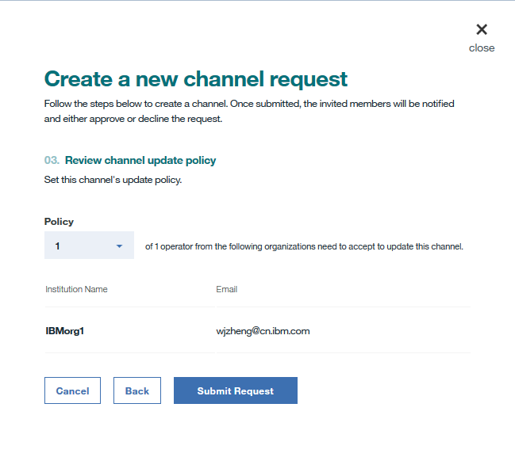

---

copyright:
  years: 2017
lastupdated: "2017-08-14"

---

{:new_window: target="_blank"}
{:shortdesc: .shortdesc}
{:screen: .screen}
{:codeblock: .codeblock}
{:pre: .pre}

# Kanal erstellen oder aktualisieren

Kanäle sind ein äußerst leistungsfähiger Mechanismus für die Partitionierung und Isolierung von Daten zum Datenschutz. Nur Mitglieder desselben Kanals können auf die Daten dieses Kanals zugreifen.
{:shortdesc}

Um die Kanalsicherheit sicherzustellen, wird eine Kanalaktualisierungsrichtlinie konfiguriert, um die Anzahl der Kanaloperatoren zu definieren, die gemeinsam eine Anforderung zur Kanalerstellung oder -aktualisierung bewilligen müssen, bevor ein Kanal erstellt oder aktualisiert wird. 

## Kanal erstellen
Klicken Sie auf die Schaltfläche **Neuer Kanal** in der Anzeige "Kanäle" Ihres Netzmonitors und führen Sie die folgenden Schritte aus, um eine Anforderung zur Kanalerstellung zu übergeben:  
1. Wählen Sie einen Namen, der das Geschäftsziel des Kanals beschreibt, fügen Sie bei Bedarf eine Beschreibung hinzu und klicken Sie auf **Weiter**. Der Kanalname muss in einem Blockchain-Netz eindeutig sein. Er muss mit einem Buchstaben beginnen und darf nur Kleinbuchstaben, Ziffern oder Bindestriche enthalten.  
    
    
2. Laden Sie eine beliebige Kombination Ihrer Netzmitglieder ein, indem Sie die Netzmitglieder auswählen und auf die Schaltfläche **Mitglied hinzufügen** klicken. Passen Sie Berechtigungen an, indem Sie Rollen für die einzelnen eingeladenen Mitglieder zuordnen, und klicken Sie auf **Weiter**.  
    
  
    * Ein Kanaloperator kann das Hauptbuch (Ledger) des Kanals abfragen oder aktualisieren. Der Kanaloperator hat die Berechtigung zum **Akzeptieren** oder **Ablehnen** einer Anforderung zur Kanalerstellung und zum Übergeben einer Anforderung zur Kanalaktualisierung. Für jeden Kanal muss es mindestens einen **Operator** geben.  
    * Ein Mitglied mit Schreibberechtigung kann das Hauptbuch des Kanals aktualisieren.
    * Ein Mitglied mit Leseberechtigung kann das Hauptbuch des Kanals nur abfragen.
  
3. Konfigurieren Sie die Kanalaktualisierungsrichtlinie durch Auswahl der Anzahl von Kanaloperatoren, die eine Anforderung zur Kanalaktualisierung genehmigen müssen, und klicken Sie auf **Anforderung übergeben**.   
    

Die eingeladenen Mitglieder erhalten eine Einladungs-E-Mail. Sie können die Anforderung mit dem Status "Abstimmung anstehend" auch auf der Anzeige **Benachrichtigungen** des Netzmonitors finden:  
* Mitglieder, die als Kanaloperatoren eingeladen werden, können auf die Schaltfläche **Anforderung überprüfen** klicken, um die Kanalkonfiguration zu überprüfen, und anschließend **Akzeptieren** oder **Ablehnen** für die Anforderung zur Kanalaktualisierung wählen. Wenn es für die Anforderung zur Kanalaktualisierung genug Zustimmung (**Akzeptieren**) von den Kanaloperatoren gibt, wird ihr Status in "Abstimmung akzeptiert" geändert. Jeder Kanaloperator kann dann auf die Schaltfläche **Anforderung übergeben** klicken, um die Kanalaktualisierung auszuführen.  
* Mitglieder, die als Schreib- oder Leseberechtigte für einen Kanal eingeladen werden, können auf die Schaltfläche **Anforderung überprüfen** klicken, um die Kanalkonfiguration zu überprüfen.

Wenn ausreichend viele Kanaloperatoren für die Anforderung zur Kanalerstellung stimmen und ein Kanaloperator die Anforderung übergibt, wird der neue Kanal erstellt (dies ist ein spezieller Typ einer Kanalaktualisierungsanforderung). Alle Kanalmitglieder finden den Kanal in der Anzeige "Kanäle" in ihrem Netzmonitor.

## Kanal aktualisieren
Wenn Sie die Konfiguration eines Kanals ändern wollen (wenn Sie z. B. Kanalmitglieder hinzufügen oder entfernen oder die Richtlinie zur Kanalaktualisierung ändern wollen), können Sie eine Anforderung zur Kanalaktualisierung übergeben. Suchen Sie in der Anzeige "Kanäle" des Netzmonitors nach dem Kanal, den Sie ändern möchten, und wählen Sie **Kanal bearbeiten** in der Dropdown-Liste unter der Überschrift **Aktion** aus. Führen Sie zum Übergeben einer Anforderung zur Kanalaktualisierung dieselben Schritte aus wie beim Übergeben einer Anforderung zur Kanalerstellung.

Alle Kanalmitglieder erhalten eine E-Mail-Benachrichtigung über die Anforderung zur Kanalaktualisierung:
* Die neu eingeladenen Mitglieder erhalten E-Mail-Benachrichtigungen, um sie einzuladen, dem Kanal beizutreten. Sie können die Anforderung mit dem Status "Abstimmung anstehend" auch auf der Anzeige **Benachrichtigungen** des Netzmonitors finden:  
    * Mitglieder, die als Kanaloperatoren eingeladen werden, können auf die Schaltfläche **Anforderung überprüfen** klicken, um die Kanalkonfiguration zu überprüfen, und anschließend **Akzeptieren** oder **Ablehnen** für die Anforderung zur Kanalaktualisierung wählen. Wenn es für die Anforderung zur Kanalaktualisierung genug Zustimmung (**Akzeptieren**) von den Kanaloperatoren gibt, wird ihr Status in "Abstimmung akzeptiert" geändert. Jeder Kanaloperator kann dann auf die Schaltfläche **Anforderung übergeben** klicken, um die Kanalaktualisierung auszuführen.  
    * Mitglieder, die als Schreib- oder Leseberechtigte für einen Kanal eingeladen werden, können auf die Schaltfläche **Anforderung überprüfen** klicken, um die Kanalkonfiguration zu überprüfen.
* Die entfernten Mitglieder erhalten E-Mail-Benachrichtigungen über die Kanaländerung.
* Vorhandene Kanaloperatoren erhalten ebenfalls eine E-Mail-Benachrichtigung zur Kanalaktualisierung. Sie können die Anforderung mit dem Status "Abstimmung anstehend" auch auf der Anzeige **Benachrichtigungen** des Netzmonitors finden und dafür **Akzeptieren** oder **Ablehnen** auswählen.

Wenn ausreichend viele Kanaloperatoren für die Anforderung zur Kanalaktualisierung stimmen und ein Kanaloperator die Anforderung übergibt, wird der Kanal aktualisiert. Alle Kanalmitglieder finden den aktualisierten Kanal in der Anzeige "Kanäle" in ihrem Netzmonitor.
