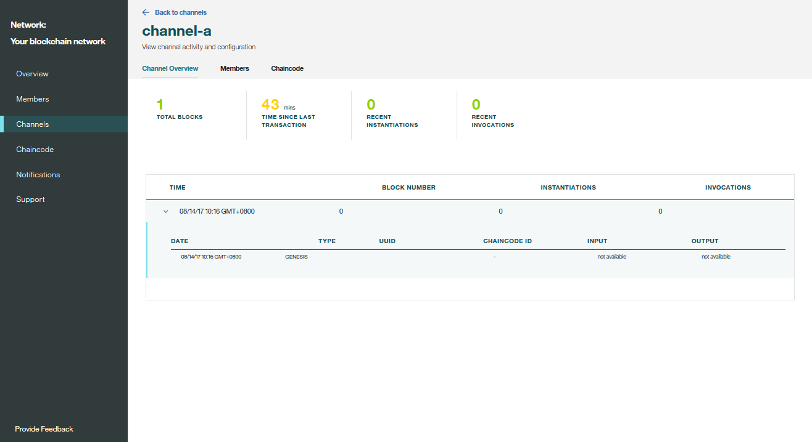

---

copyright:
  years: 2017
lastupdated: "2017-07-14"

---

{:new_window: target="_blank"}
{:shortdesc: .shortdesc}
{:screen: .screen}
{:codeblock: .codeblock}
{:pre: .pre}

# {{site.data.keyword.blockchain}}-Netz überwachen

Dieses Lernprogramm zeigt, wie Sie Statusinformationen zu Ihrem {{site.data.keyword.blockchain}}-Netz unter {{site.data.keyword.Bluemix_short}} anzeigen und überwachen können.
{:shortdesc}

Rufen Sie den Netzmonitor auf und suchen Sie nach dem Kanal, den Sie in der Anzeige "Kanal" anzeigen und überwachen möchten. In der Anzeige des betreffenden Kanals können Sie die Datenstatusinformationen, Mitglieder und den instanziierten Chaincode dieses Kanals in drei Registerkarten anzeigen:

* **Kanalüberblick**  
  Die Registerkarte "Kanalüberblick" zeigt die Blockinformationen zu diesem Kanal:
    * Eine Reihe von Datenpunkten, einschließlich der Gesamtanzahl der erstellten Blöcke, des Zeitintervalls seit der letzten Transaktion, der Anzahl von Chaincode-Instanziierungen und der Anzahl von Chaincode-Aufrufen.
    * Eine Tabelle, die alle Blöcke auf diesem Kanal auflistet. Wenn Sie einen Block erweitern, werden detaillierte Informationen zu dem Block angezeigt.  

    

* **Mitglieder**  
  Auf der Registerkarte "Mitglieder" werden die Informationen der Mitglieder auf diesem Kanal angezeigt, einschließlich der E-Mail-Adressen für die Operatoren des Organisation.
    
  
* **Chaincode**  
  Auf der Registerkarte "Chaincode" werden alle Chaincodes aufgelistet, die auf diesem Kanal instanziiert werden - mit der Chaincode-ID, der Version und der Anzahl Peers, die den Chaincode ausführen.   
    
  Erweitern Sie eine Chaincode-Zeile, um detaillierte Informationen zu dem Chaincode abzurufen:   
    * Sie können auf **JSON** klicken, um die JSON-Datei des Chaincodes anzuzeigen.
    * Sie können auf **Protokolle** klicken, um Protokolle des Chaincodes anzuzeigen.
    * Sie können auf **Löschen** klicken, um die aktiven Chaincode-Container zu entfernen.
  
   
  
