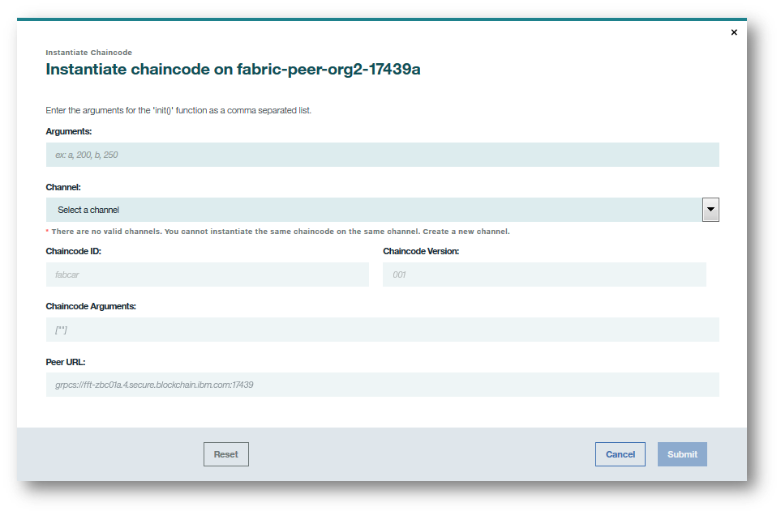

---

copyright:
  years: 2017
lastupdated: "2017-08-14"
---

{:new_window: target="_blank"}
{:shortdesc: .shortdesc}
{:codeblock: .codeblock}
{:screen: .screen}
{:pre: .pre}

# Installation et instanciation d'un code blockchain

Le code blockchain est un logiciel, écrit en Go ou Java, qui encapsule la logique métier et les instructions transactionnelles
pour la création et la modification des actifs.  Il s'exécute dans un conteneur Docker associé à un homologue qui doit interagir avec lui.  Pour plus d'informations sur le développement des codes blockchain, voir [Chaincode Tutorials ](http://hyperledger-fabric.readthedocs.io/en/latest/chaincode.html).
{:shortdesc}

Le code blockchain est tout d'abord installé sur le système de fichiers d'un homologue, puis il est instancié sur un canal.  Tous les membres de canal doivent installer le code blockchain sur chaque homologue qui va exécuter le code blockchain.  Pour utiliser le même code blockchain, les membres du canal doivent lui donner le même nom et la même version lors de l'installation de ce code blockchain.  L'étape d'instanciation implique l'initialisation des paire clé-valeur et le déploiement du conteneur de code blockchain.  Tout homologue, via lequel les applications vont interagir avec un code blockchain, doit comporter le code blockchain installé sur son système de fichiers et disposer d'un conteneur de code blockchain opérationnel.  Toutefois, si un homologue utilise le même code blockchain sur plusieurs canaux, il n'a besoin que d'une seule instance du conteneur.  

La combinaison installation/instanciation est une fonction puissante car elle permet à un homologue d'interagir avec le même conteneur de code blockchain sur plusieurs canaux.  Le seul prérequis est que le source de code blockchain réel soit installé sur le système de fichiers de l'homologue.  De cette façon, si un élément de code blockchain est utilisé sur des douzaines de canaux, un homologue n'aura besoin que d'un seul conteneur de code blockchain pour exécuter des opérations de lecture/écriture sur tous les registres de canal.  Cette approche souple se révèle bénéfique pour les performances et le débit de calcul dès lors que l'échelle des réseaux et les applications de code blockchain deviennent plus élaborés.  

## Installation d'un code blockchain
Vous devez installer le code blockchain sur chaque homologue qui va exécuter le code blockchain.  Pour installer un code blockchain, procédez comme suit :
1. Dans l'écran "Code blockchain" de votre moniteur réseau, sélectionnez dans la liste déroulante un homologue sur lequel installer le code blockchain.  Cliquez sur le bouton **Installer le code blockchain**.
    
  
2. Dans Ia fenêtre contextuelle **Installer le code blockchain**, entrez le nom et la version de votre code blockchain. **Notez** que les chaînes de nom et de version seront utilisées dans les applications pour interagir avec les codes blockchain installés.  Cliquez sur le bouton **Parcourir** et parcourez votre code système de fichiers local jusqu'à l'emplacement de stockage de la source de votre code blockchain.  Sélectionnez un ou plusieurs fichiers source de code blockchain à installer sur votre homologue.  Cet exemple illustre un fichier source de code blockchain `fabcar.go` nommé `Chaincode1` en version `v001`, qui va être installé sur l'homologue `fabric-peer-org2-17439a`.
  

## Instanciation d'un code blockchain
Une fois le code blockchain installé sur le système de fichiers de chaque homologue qui rejoint un canal, il est nécessaire de l'instancier sur le canal de sorte que les homologues puissent interagir avec le registre via le conteneur de code blockchain.  L'instanciation exécute l'initialisation nécessaire du code blockchain.  Cela implique souvent la définition de paires clé-valeur qui comprennent la base de données "world state" initiale d'un code blockchain.  

Vous devez posséder les droits **Opérateur** ou **Rédacteur** sur le canal pour pouvoir instancier le code blockchain.  Le code blockchain dont le nom et la version sont identiques sur différents homologues doit être instancié une seule fois pour le déploiement du conteneur de code blockchain.  Pour instancier un code blockchain, procédez comme suit :
1. Dans l'écran "Code blockchain" de votre moniteur réseau, sélectionnez l'homologue sur lequel vous avez installé le code blockchain et localisez le code blockchain que vous voulez instancier dans le tableau de code blockchain.  Ensuite, cliquez sur le bouton **Instancier** sous l'en-tête **Action**.  
    
  
2. Dans la fenêtre contextuelle **Instancier un code blockchain**, définissez les paires clé/valeur en tant qu'arguments pour l'initialisation du code blockchain, puis sélectionnez le canal dans lequel effectuer l'instanciation.  Cliquez sur **Soumettre**.
     
