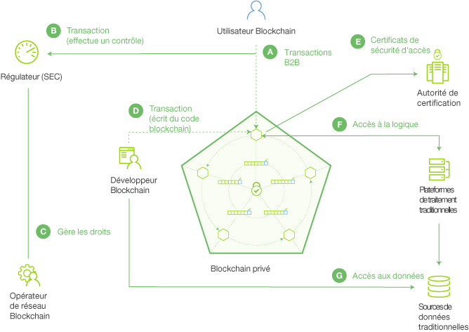

---

copyright:
  years: 2016, 2017
lastupdated: "2017-07-28"
---

{:new_window: target="_blank"}
{:shortdesc: .shortdesc}
{:codeblock: .codeblock}
{:screen: .screen}
{:pre: .pre}

# Concepts de base relatifs au blockchain
{: #ibmblockchain_overview}

Blockchain est une technologie de registre distribuée d'égal à égal qui rationalise les processus métier en établissant de nouveaux niveaux de confiance, de responsabilité et de transparence pour une nouvelle génération d'applications transactionnelles. Le réseau de blockchain a initialement été introduit sur le marché pour les échanges de bitcoin, mais dans la pratique ses usages vont bien au-delà des échanges de crypto-monnaie. En association avec le projet Hyperledger de Linux Foundation, {{site.data.keyword.blockchainfull}} redonne un nouveau visage aux échanges commerciaux les plus fondamentaux, et il ouvre la voie à un nouveau monde d'interactions numériques.

{{site.data.keyword.blockchain}} réduit le coût et la complexité des transactions inter-entreprises via la création de réseaux efficaces et hautement sécurisés où tout ce qui a virtuellement de la valeur peut être suivi et échangé, sans la nécessité d'un organe centralisé de contrôle. Dans le monde de la finance, les réseaux de blockchain permettent de régler des opérations sur titres en seulement quelques minutes, alors que plusieurs jours étaient auparavant nécessaires. Dans le monde du commerce, cela pourrait simplifier la gestion de la chaîne logistique globale et permettre le suivi et la consignation en temps réel du flux de marchandises et de paiements. 

## Présentation du réseau de blockchain

Dans un réseau {{site.data.keyword.blockchain}}, les enregistrements des transactions réseau sont conservés dans un registre partagé qui est répliqué entre l'ensemble ou un sous-ensemble de membres du réseau (les registres existent dans le cadre d'un canal, de sortie que si l'homologue d'un membre n'est pas abonné à un canal, il n'aura pas les transactions de ce canal). Les enregistrements de toutes les transactions, valides et non valides, sont regroupés par blocs et ajoutés à la chaîne de hachage (c'est-à-dire la blockchain) de chaque canal. Les transactions valides mettront a jour la base de données "world state", ce que ne peut pas faire une transaction non valide. Les codes blockchain (également appelés "contrats intelligents") sont les éléments logiciels qui contiennent un ensemble de fonctions permettant les opérations de lecture et d'écriture dans le registre. Les applications côté client utilisent un kit SDK pour créer une interface avec un ou plusieurs homologues, et au final appeler des fonctions sur un code blockchain spécifique. Deux API Fabric principales autorisent la lecture ou l'écriture d'un code blockchain : `getState` & `putState`.

La **Figure 1** illustre un exemple de réseau de blockchain privé, qui bénéficie d'une architecture distribuée, d'égal à égal décentralisée et d'une autorité de certification qui gère les rôles utilisateur et les droits :

*Figure 1. Réseau de blockchain privé : le flux de données et l'accès au réseau sont régis par des rôles de membre*

Les descriptions ci-après correspondent à l'architecture et au flux illustrés dans la Figure 1 (remarque : il ne s'agit pas d'un traitement séquentiel) :

**A :** Un utilisateur Blockchain soumet une transaction au réseau de blockchain. La transaction peut être un déploiement (deploy), un appel (invoke) ou une requête (query) et elle est émise via une application côté client qui optimise un logiciel, ou directement à partir d'une API REST.  

**B :** Des réseaux d'entreprise de confiance accordent l'accès à des régulateurs et des auditeurs (la SEC sur les marchés boursiers américains, par exemple).  

**C :** Un opérateur de réseau de blockchain gère les droits des membres comme l'inscription du Régulateur (B) en tant qu'"auditeur" et de l'utilisateur Blockchain (A) en tant que "client." Un auditeur peut être limité à l'interrogation du registre tandis qu'un client peut être autorisé à déployer, appeler et interroger certains types de code blockchain. 

**D :** Un développeur Blockchain écrit du code blockchain et des applications côté client. Le développeur de chaîne de blocs peut déployer du code blockchain directement sur le réseau, via une interface REST. Pour inclure les données d'identification d'une source de données traditionnelle dans le code blockchain, le développeur peut utiliser une connexion externe pour accéder aux données (G). 

**E :** Un utilisateur de chaîne de blocs se connecte au réseau via un noeud homologue (A). Avant de poursuivre des transactions, le noeud extrait les certificats d'inscription et de transaction de l'utilisateur de l'autorité de certification. Les utilisateurs doivent être en possession de ces certificats numériques pour effectuer des transactions sur un réseau privé.

**F :** Un utilisateur qui essaie d'activer du code blockchain peut être invité à vérifier ses données d'identification sur une source de données traditionnelle (G). Pour confirmer l'autorisation d'un utilisateur, le code blockchain peut utiliser une connexion externe à ces données, via une plateforme de traitement traditionnelle.
