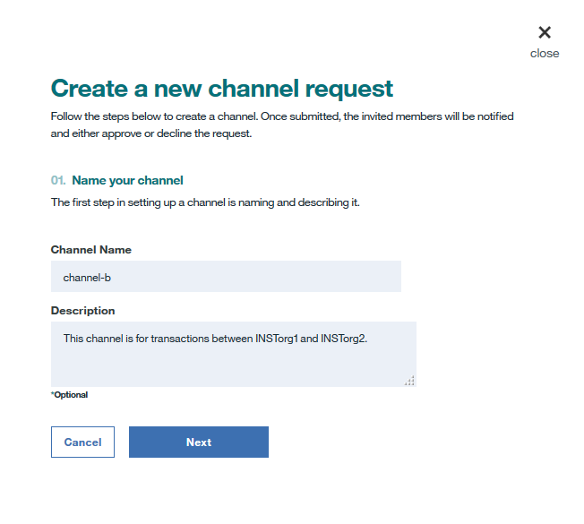

---

copyright:
  years: 2017
lastupdated: "2017-12-05"

---

{:new_window: target="_blank"}
{:shortdesc: .shortdesc}
{:screen: .screen}
{:codeblock: .codeblock}
{:pre: .pre}

# Creazione o aggiornamento di un canale

I canali rappresentano un meccanismo incredibilmente potente per il partizionamento e l'isolamento dei dati e forniscono il fondamento primario per
la privacy dei dati.  Solo i membri dello stesso canale possono accedere ai dati di questo canale.
{:shortdesc}

Per garantire la sicurezza del canale, la politica di aggiornamento del canale è configurata per definire il numero di operatori del canale che devono concordare sulla richiesta di creazione o di aggiornamento del canale prima che un canale venga creato o aggiornato. 

## Creazione di un canale
Fai clic sul pulsante **New Channel** nella schermata "Channels" del tuo Network Monitor e completa la seguente procedura per inoltrare una richiesta di creazione di un canale.  
1. Scegli un nome che rifletta l'obiettivo di business del canale, aggiungi una descrizione facoltativa e fai clic su **Next**.  Il nome del canale deve essere univoco in una rete blockchain.  Deve iniziare con una lettera e può contenere solo caratteri minuscoli, numeri, o trattini.  
    
    
2. Invita qualsiasi combinazione di membri della tua rete selezionandoli e facendo clic sul pulsante **Add Member**.  Personalizza le autorizzazioni assegnando i ruoli per ciascuno dei membri invitati e fai clic su **Next**.  
    
  
    * Un operatore del canale può interrogare mediante query o aggiornare il libro mastro del canale.  L'operatore del canale dispone dell'autorizzazione ad accettare (**Accept**) o rifiutare (**Decline**) una richiesta di creazione di un canale e di inoltrare una richiesta di aggiornamento del canale. Ci deve essere almeno un **Operatore** in ciascun canale.  
    * Uno scrittore di canale può aggiornare il libro mastro del canale.
    * Un lettore del canale può solo interrogare mediante query il libro mastro del canale.
  
3. Configura la politica di aggiornamento del canale selezionando il numero di operatori del canale per l'approvazione di una richiesta di aggiornamento del canale e fare clic su **Submit Request**.   
    

I membri invitati riceveranno una email di invito.  Possono anche trovare la richiesta nelle schede secondarie "All" o "Pending" nella schermata **Notifications** di Network Monitor.  
* I membri invitati come operatori del canale possono fare clic sul pulsante **Review Request** per riesaminare la configurazione del canale e quindi accettare (**Accept**) o rifiutare (**Decline**) la richiesta. La colonna "My Status" visualizza lo stato di voto dell'operatore per la richiesta:
    * _Vote Pending_: l'operatore non ha gestito la richiesta.
    * _Vote Accepted_: l'operatore ha accettato la richiesta.
    * _Vote Declined_: l'operatore ha rifiutato la richiesta.
    * _Vote Closing_: la richiesta ha ottenuto abbastanza voti **Accept** e l'operatore non ha più bisogno di accettarla o rifiutarla.
* I membri invitati come scrittori o lettori del canale possono visualizzare *Not Required* nella colonna "My Status". Prima che la richiesta ottenga abbastanza voti **Accept** dagli operatori del canale, gli scrittori o i lettori possono fare clic sul pulsante **Review Request** per controllare la configurazione del canale.

Quando un numero sufficiente di operatori del canale concorda sulla richiesta, uno qualsiasi dei membri del canale può fare clic sul pulsante **Submit Request** e il nuovo canale viene creato.  Tutti i membri del canale possono trovare il canale nella schermata "Channels" del loro Network Monitor.

## Aggiornamento di un canale
Se vuoi modificare la configurazione di un canale, ad esempio aggiungere o rimuovere dei membri del canale o modificare la politica di aggiornamento del canale, puoi inoltrare una richiesta di aggiornamento del canale.  Nella schermata "Channels" del tuo Network Monitor, individua il canale che vuoi modificare e seleziona **Edit Channel** dall'elenco a discesa sotto l'intestazione **Action**. Naviga attraverso i pannelli per apportare le modifiche alle entità desiderate e fai clic su **Submit Request** per avviare una richiesta di aggiornamento del canale.

Tutti i membri del canale riceveranno notifiche email relative alla richiesta di aggiornamento del canale: 
* I membri appena invitati riceveranno delle notifiche email per invitarli ad aderire al canale.  Possono anche trovare la richiesta con lo stato "Vote Pending" nella schermata **Notifications** del Network Monitor. 
    * I membri invitati come operatori del canale possono fare clic sul pulsante **Review Request** per riesaminare la configurazione del canale e quindi accettare (**Accept**) o rifiutare (**Decline**) la richiesta di aggiornamento del canale.  La colonna "My Status" visualizza lo stato di voto dell'operatore per la richiesta:
        * _Vote Pending_: l'operatore non ha gestito la richiesta.
        * _Vote Accepted_: l'operatore ha accettato la richiesta.
        * _Vote Declined_: l'operatore ha rifiutato la richiesta.
        * _Vote Closing_: la richiesta ha ottenuto abbastanza voti **Accept** e l'operatore non ha più bisogno di accettarla o rifiutarla.
    * I membri invitati come scrittori o lettori del canale possono visualizzare *Not Required* nella colonna "My Status". Prima che la richiesta ottenga abbastanza voti **Accept** dagli operatori del canale, gli scrittori o i lettori possono fare clic sul pulsante **Review Request** per controllare la configurazione del canale.
* I membri rimossi ricevono delle notifiche email sulla modifica del canale. 
* Gli operatori del canale esistenti ricevono notifiche email sull'aggiornamento del canale. Possono trovare la richiesta con lo stato _Vote Pending_ nella schermata **Notifications** di Network Monitor per poterla accettare (**Accept**) o rifiutare (**Decline**).
* Anche gli scrittori o i lettori del canale esistenti ricevono notifiche email sull'aggiornamento del canale.  Possono trovare la richiesta con lo stato _Not Required_ nella schermata **Notifications** del Network Monitor.

Quando un numero sufficiente di operatori del canale concorda sulla richiesta, uno qualsiasi dei membri del canale può fare clic sul pulsante **Submit Request** e il canale viene aggiornato. Tutti i membri del canale possono trovare il canale aggiornato nella schermata "Channels" del Network Monitor. 
