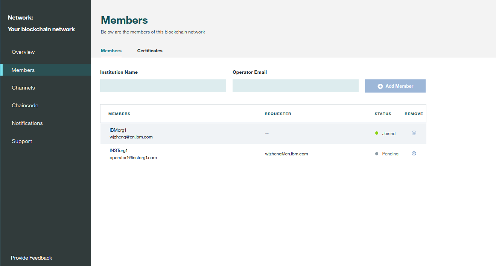
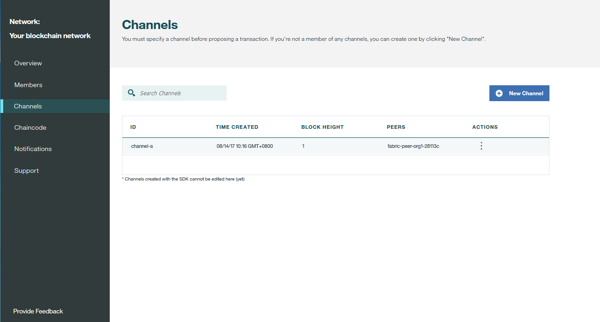
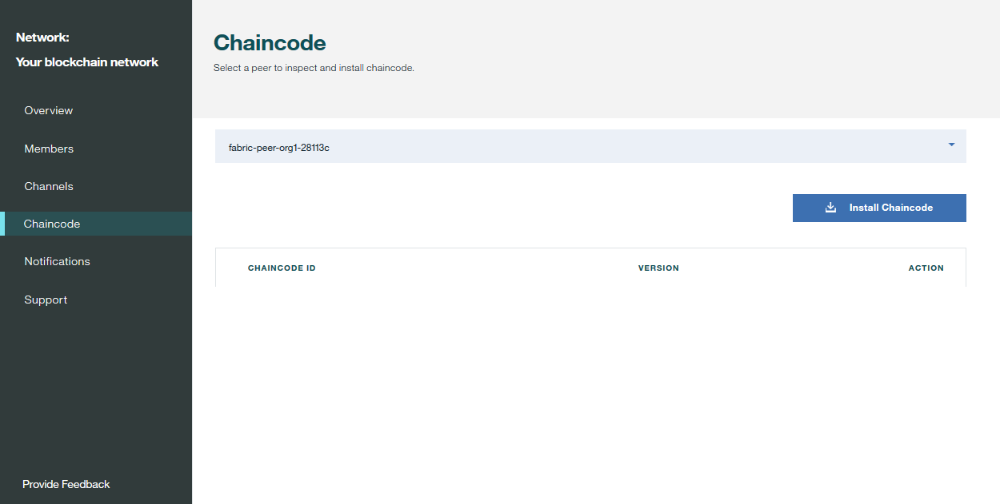

---

copyright:
  years: 2017
lastupdated: "2017-08-15"
---

{:new_window: target="_blank"}
{:shortdesc: .shortdesc}
{:codeblock: .codeblock}
{:screen: .screen}
{:pre: .pre}

# Operate the network
{: #v10_dashboard}

The Network Monitor provides an overview of your blockchain environment, including network components, members, joined channels, performance data, and deployed chaincodes.
{:shortdesc}

The Network Monitor exposes the following screens:
* In the "Overview" screen, you can view network service credentials, component status information, and add peers.
* In the "Members" screen, you can manage network members and certificates.
* In the "Channels" screen, you can create new channels and view information on existing channels.
* In the "Chaincode" screen, you can install and instantiate chaincodes on your peers.
* In the "Notifications" screen, you can handle pending approvals and view completed approvals.
* In the "Support" screen, you can find links for reference resources and see new and changed functions in each release.

## Overview

The "Overview" screen displays real-time status information on your blockchain components including the orderer, CA, and peer nodes. Each component is displayed under four distinct headers: **Type**, **Name**, **Status**, and **Actions**. During the creation of your blockchain network, three orderer nodes and two CA nodes are automatically created.  The CA's are member-specific, whereas the ordering nodes are common endpoints shared across the network.

**Figure 1** shows the "Overview" screen:

*Figure 1. Network overview*

- Node actions

  The **Actions** header of the table provides buttons to start or stop your components. You can also start or stop a group of nodes by selecting multiple nodes and then clicking the **Start Selected** or **Stop Selected** button. The **Start Selected** or **Stop Selected** button appears on top of the table when you select one or more nodes.

  You can also check component logs by clicking **View Logs** from the dropdown list under the **Actions** header. The logs expose the remote procedure calls occurring between the various network components and are useful for debugging and troubleshooting. For example, experiment by stopping a peer and attempting to target it with a transaction; you will see gRPC connectivity errors. When you restart the peer and attempt the transaction again you will see a successful connection. You can also leave a peer down for an extended period of time as your channel(s) continue to transact. When the peer is brought back up you will notice a synchronization of the ledger through gossip protocol. As soon as the peer has fully synchronized the ledger, you can perform normal invokes and queries.  
- Service Credentials  
  You can view the JSON file about low level network information of each component by clicking the **Service Credentials** button at the top right of the "Resources" tab. This is all the configuration info that you will need for an application. Note, however, that this file only contains the addresses for your specific components and the shared ordering nodes. If you need to target additional peers, you'll need to obtain their endpoints.
  The header containing "url" displays the API endpoint of each component. These endpoints are required in order to target specific network components from a client-side application and their definitions will typically live in a JSON-modeled configuration file that accompanies the app. If you are customizing an application that requires endorsement from peers that are not part of your organization, you'll need to retrieve the IP addresses of those peers from the relevant operators in an out-of-band operation. Clients must be able to connect to any peers from which they need a response.  
- Add peers  
  Click the **Add Peers** button at the top right to add peer nodes to your network. Each member can add up to six peers in a network. You can add peer nodes for the first time when you create or join a network or later in the Network Monitor.   
  In the pop-up "Add Peers" panel, select the number and size of peer nodes you want to add.  Currently only "small" peers are available for purchase, however there will eventually be "medium" and "large" to help accommodate larger workloads and higher transaction throughput.  Details on peer sizing and performance metrics is coming soon...
  
## Members

The "Members" screen contains two tabs to display network member information in the "Members" tab and certificate information in the "Certificates" tab.

**Figure 2** shows the initial "Members" screen displaying your network members in the "Members" tab:

*Figure 2. Network members*

Besides the members that you invite when you create the network, you can invite other members in the "Members" tab. To invite a member to your network, enter the institution name and operator's email address and click **Add Member**. A network can have a total of 15 members (including the network initiator). To remove a member from your network, click the "remove" symbol at the end of the member row.

**Figure 3** shows the initial "Members" screen displaying member certificates in the "Certificates" tab:

*Figure 3. Certificates*

Operators can manage the certificates for the members in the same institution in the "Certificates" tab. Click **Add Certificate** to open the "Add Certificate" panel. Give a name to your certificate, paste your client-side certificates in PEM format to the "Key" field, and click **Submit**. You need to restart your peers before the client-side certificates can take effect.

For information about generating your cerficate key, see [Generating the client-side certificates](v10_application.html#generating-the-client-side-certificates).

## Channels

You can segregate your network into channels where each channel represents a subset of members that are authorized to see the data for the chaincodes instantiated on that channel. Every network must have at least one channel for transactions to take place. Each channel has a unique ledger and users must be properly authenticated to perform read/write operations against this ledger. If you're not on a channel, you can't see any data.

**Figure 4** shows the initial dashboard screen displaying an overview of all channels in your network:

*Figure 4. Channels*

Creating a channel will result in the generation of a channel-specific ledger. For more information, see [Creating a channel](howto/create_channel.html).

You can also select an existing channel to view more precise details about the channel, membership, and active chaincodes. For more information, see [Monitoring a network](howto/monitor_network.html).  

## Chaincode

Chaincode defines the business logic and transactional instructions for creating and modifying assets.

**Figure 5** shows the initial dashboard screen of chaincodes:

*Figure 5. Chaincodes*

Chaincode is first installed on a peer's filesystem and then instantiated on a channel.  For more information, see [Installing and instantiating a chaincode](howto/install_instantiate_chaincode.html).

## Notifications

You can handle pending requests and view completed requests in the "Notifications" screen. 

**Figure 6** shows the "Notifications" screen:

*Figure 6. Notifications*

* When you create a channel or are invited to a new channel, a notification will appear in the Network Monitor. 
* The requests are grouped into "All", "Pending", and "Completed" subtabs. Numbers after the subtab header indicate the number of requests in each subtab.
   * You can find all your requests in the "All" subtab.
   * Requests that you have not accepted or declined, or you have not viewed, are in the "Unread" subtab. Click the **Review Request** button to view the request, which includes the channel policy and members, and then either **Accept** or **Decline** it. You can also handle the requet at another time by clicking **Later**. If you accept a request and the request is accepted by enough channel operators, you can click **Submit Request** to activate the channel update.  
   * A submitted request will appear in the "Completed" subtab.  You can click **Review Request** to view its details.
  
When you have a long list of requests, you can search for a request in the search field on the top. Pending requests can be deleted by selecting the boxes in the front of them and clicking **Delete Requets**. Note that a completed request cannot be deleted.

## Support

The "Support" screen contains two tabs to provide support information in the "Support" tab and to describe new and changed functions of each release in the "Release Notes" tab.

Use the links and resources on this page to access troubleshooting and support forums. If you are unable to debug your issue or ascertain an answer to your question, please click the **Open a Bluemix support ticket** link and follow the guidance to submit tickets.

**Figure 7** shows the initial "Support" screen displaying support information in the "Support" tab:

*Figure 7. Blockchain support*

* [{{site.data.keyword.blockchainfull_notm}} Service docs](index.html), which is this doc site, provides guidances on how to start with {{site.data.keyword.blockchainfull_notm}} Platform on {{site.data.keyword.Bluemix_notm}}. You can find coresponding topics from the navigator or search any term with the search function on the top.  
* [IBM Developer Works ](https://developer.ibm.com/blockchain/) under **Community help** contains resources and information for developers.  
* [IBM dWAnswers ](https://developer.ibm.com/answers/smartspace/blockchain/) under **Support ticket** serves as a platform for questions and responses. You can search for responses from previously posed questions or submit a new question. Be sure to include the keyword **blockchain** in your question.   
  You can also submit a ticket to {{site.data.keyword.blockchainfull_notm}} support team with the [Open a {{site.data.keyword.Bluemix_notm}} support ticket ]() option.  Share details and code snippets from your specific Bluemix instance.  
* [Sample applications ]() under **{{site.data.keyword.blockchain}} sample applications** provides guidance and sample code snippets to assist in the development of applications.  
* [Hyperledger Fabric ](http://hyperledger-fabric.readthedocs.io/) and [Hyperledger Fabric community ]() under **Hyperledger Fabric** provide more details about the Hyperledger Fabric stack.  
  Talk to a [Hyperledger Expert ](https://chat.hyperledger.org/channel/general) with questions about the Hyperledger Fabric code.   
  
  
**Figure 8** shows the initial "Members" screen displaying new and changed functions of each release in the "Release Notes" tab:

*Figure 8. Release notes*

