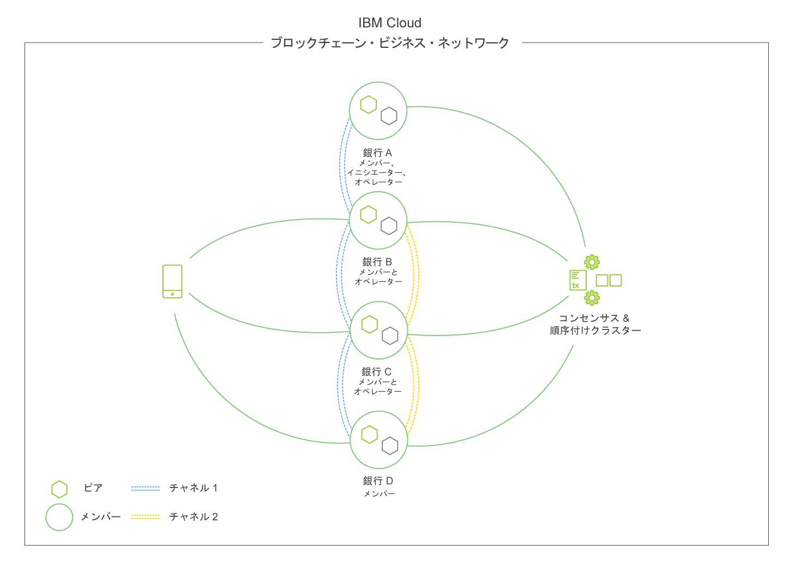

---

copyright:
  years: 2017
lastupdated: "2017-08-24"

---

{:new_window: target="_blank"}
{:shortdesc: .shortdesc}
{:screen: .screen}
{:codeblock: .codeblock}
{:pre: .pre}

# {{site.data.keyword.blockchainfull_notm}} プラットフォーム

**重要:** {{site.data.keyword.blockchainfull}} オファリングを使用する前に、[特記事項](needtoknow.html)のセクションにある技術情報とサポート情報をお読みください。  
{:shortdesc}

{{site.data.keyword.blockchainfull_notm}} プラットフォームは、複数の組織にまたがるブロックチェーン・ネットワークのライフサイクル全体 (**開発**、**ガバナンス**、 **運用**) に対応した唯一の統合ビジネス・プラットフォームです。各フェーズでコラボレーションを採用することによって、「ビルト・フォー・ビジネス」のグローバル・ブロックチェーン・ネットワークの作成を加速すること。それが、このプラットフォームの設計思想です。要求事項の多いユース・ケースや厳しい規制がかかっている業界にも通用するレベルのパフォーマンスとセキュリティーを実現できます。{{site.data.keyword.blockchainfull_notm}} オファリングの構築基盤は、Hyperledger Fabric V1.0 のコード・ベースです。このコード・ベースでは、ビジネス・ニーズに対応したエンタープライズ・レベルのセキュリティー、データ保全性、スケーラビリティー、パフォーマンスを実現するために、モジュラー・アーキテクチャーを採用しています。  

ここでは、{{site.data.keyword.blockchainfull_notm}} ネットワークの主なアクティビティーと役割を取り上げます。それぞれのアクティビティーや役割がネットワークのライフサイクルにどうかかわっているのかを見ていきましょう。 

**注**: 下の表は、直線的に作業を進める状況に対応したものではありません。アプリケーションやメンバーシップの進展に合わせて、開発やネットワーク管理などのタスクを繰り返し行う必要があります。

|  機能     | アクティビティー       | 役割  |
| ------------------------- |--------------------------|-----|
| [開発 ](https://developer.ibm.com/blockchain/sandbox/) | アプリケーションの開発、チェーン・コードの開発 | アプリケーション開発者 |
| [ガバナンス](get_start.html)| メンバーの招待、資格情報の生成、ガバナンス・モデルの提示、新規メンバーの参加、証明書やエンドポイントの情報の配信| ネットワーク・オペレーター、ネットワーク・メンバー |
| [運用](v10_dashboard.html)| 正常性やアクティビティーのモニター、新規デプロイメントの管理、メンバーの管理 (追加/削除)、チェーンコード・ライフサイクルの管理、チャネルの管理、サポート | ネットワーク・オペレーター、ネットワーク参加者 |
  
では、このような役割やアクティビティーを詳しく見ていきましょう。

## ネットワークの**開発**
400 以上のクライアント・エンゲージメントで磨かれたベスト・プラクティスを活用して、ブロックチェーン開発を検討し、加速します。
* テクノロジーを活用して各ビジネスを緊密に調整することによって、ブロックチェーン・アプリケーション開発の時間を大幅に短縮できます (通常は開発に 6 週間かかるようなアプリケーションを 2 日もあれば作成できます)。
* {{site.data.keyword.blockchainfull_notm}} の開発者ツールを使用すれば、既存のプログラマーがブロックチェーン・スキルを短期間で習得できます。
* 開発者は、オープンな最先端ツール・セットを使用して、自分の好みの環境での開発作業を柔軟に習得できます。  
  
ビジネス・オーナーは、IBM ブロックチェーン・プラットフォームの威力を十分に活用するために、{{site.data.keyword.blockchainfull_notm}} Garage に参加している IBM のブロックチェーン専門家や業種別専門家のサポートを受けながらユース・ケースを開発できます。 

開発者は、各種のビジネス要件を短時間で調整し、ブロックチェーン・アプリケーション開発を加速できます。無料のクラウド・サンドボックスやインタラクティブ・プレイグラウンドを使用すれば、どんなプログラマーもブロックチェーン開発者になれます。ビジネス・ルールをそれぞれの好みの環境でコードに変換すること。それが、そのようなツールの設計思想です。
* **オンラインでの検討**  
オープン・ソースの開発ツールである [Hyperledger Composer ](https://hyperledger.github.io/composer/introduction/introduction.html)を使用して、ブロックチェーンの重要な概念を習得したり、ネットワーク定義を作成したり、再使用可能な業種別モデルやスマート・コントラクト・ライブラリーを利用したりできます。 
* **ローカル・インストール**  
IBM 認定イメージの Hyperledger Fabric and Composer (ビジネス・ネットワークを構築するためのオープン・ソース・フレームワーク) を利用して、開発とテストの作業をラップトップで直接実行できます。
* **クラウド環境でのコラボレーション**  
コードを開発して他のユーザーと共有するための無料オプションと有料オプションがあります。
  
ビジネス・ネットワークを開発したら、この[レシピ](https://ibm-blockchain.github.io/platform-deployment/)を使用して、IBM ブロックチェーン・プラットフォームで稼働するライブ・ネットワークにデプロイできます。

## ネットワークの**ガバナンス**
ネットワークのバックエンド環境を作成するためのオプションが 2 つあります。1 つは、公開した Hyperledger Docker イメージを使用するという方法です。その場合は、アプリケーションを作成したり、ネットワークと対話したりするために、Composer ライブラリーを実装できます。2 つ目は、ネイティブのチェーンコードを作成し、トランザクションを駆動するためのサーバー・サイド・コードを開発する、という方法です。ローカル環境での実行は、ネットワーク構成を調整したり、可能性のあるユース・ケースを検討したり、PoC (概念検証) を開始したりするための理想的な機会になります。PoC の形が見え始めた段階で、ネットワークをクラウドでホストして実装を拡張できます。

クラウド・デプロイメントの場合は、使いやすいレシピやスクリプトのコレクションを利用して、Kubernetes で稼働する Hyperledger Fabric ネットワークのデプロイメントを簡略化できます。このフェーズで、ホスト環境での PoC の動作や安定性をテストしてください。アプリケーションの機能や回復力をテストするためのメカニズムや、エンタープライズ・プランの先行版として、[{{site.data.keyword.blockchainfull_notm}} Container Service ](https://ibm-blockchain.github.io/)を利用できます。

ネットワーク管理について言えば、1 人のメンバーがすべてを制御するのではなく各メンバーに一定の制御能力を与える形でネットワーク管理の環境を作成すること。これが、{{site.data.keyword.blockchainfull_notm}} の設計思想です。{{site.data.keyword.blockchainfull_notm}} プラットフォームには、カスタマイズ可能なポリシーによってネットワークの変更管理をチームとして実行するための統合ツールの初期セットが用意されています。 

このガバナンス・モデルの主要機能を以下にまとめます。

* 集合的な管理を実施するための民主的管理ツール。
* ネットワーク変更のガバナンスのための柔軟性の高い民主的なポリシーを定義するポリシー・エディター。
* 研修やカスタマイズやアクティベーションを高速化するための事前作成のツールやポリシー。
* 統合通知機能やメンバー・アクティビティー・パネルや安全なシグニチャーのコレクションを備えたマルチパーティー・ワークフロー・ツール。

## ネットワークの**運用**
実稼働環境にも対応できるセキュア・サービスを使用して、非集中型のネットワークをデプロイして運用します。小さなネットワークから始めて、メンバーシップやトランザクションのボリュームが大きくなるにつれて規模を拡大していきます。そのために、以下の機能を利用できます。

* ハードウェア/ファームウェア/ソフトウェアの多彩なセキュリティー機能を備えたウルトラ・ハイ・セキュリティー環境。
* スケーラビリティーや回復力や可用性を高めるための堅牢なアーキテクチャー。
* 世界有数の計算スピードを誇る Linux コンピューターでの実行とパフォーマンスに最適化した環境。
  
{{site.data.keyword.blockchainfull_notm}} プラットフォームでネットワークを運用すれば、管理用タスクを簡略化するためのツールや機能を利用できます。

* ネットワーク・リソースをモニターしたり管理したりするためのダッシュボード。 
* コード・スタック全体のシームレスなアップグレードに対応したライフサイクル管理機能。
* ポータルに統合した毎日 24 時間態勢のテクニカル・サポート。
* 厳しい規制がかけられている業界の機密データをやり取りするネットワークに対応した堅牢なセキュリティー・スタック。特権的なアクセス権はなく、マルウェアや改ざんへの対策や 100% の暗号化などの多彩な機能が盛り込まれています。

## ブロックチェーン・ネットワークへの参加 

ここでは、**参加者**という言葉を広い意味で使います。参加者は、ブロックチェーン・ネットワークにかかわるあらゆる組織や個人やアプリケーションやデバイスを指す言葉です。「参加者」というくくりの中に、**メンバー**と**ユーザー**という 2 つのグループがあります。   
 
簡単に言えば、メンバーは有効なデジタル証明書を持っています。その証明書があれば、ブロックチェーン・ネットワークでトランザクションを実行したり検証したりできます。ユーザーには証明書がありません。それでも、既存のネットワーク・メンバーを通じてブロックチェーン・ネットワークにかかわることができます。メンバーの証明書は、フィットネス・クラブなどの「メンバーシップ・カード」のようなものです。ユーザーは、そのようなメンバーシップ・カードがなくても、既存のメンバーの「ゲスト」としてフィットネス・クラブに入場できます。そのような役割を詳しく見ていきましょう。

### メンバー 

{{site.data.keyword.blockchainfull_notm}} プラットフォームの基盤になっているのは、「許可制ブロックチェーン」テクノロジーである Hyperledger Fabric です。したがって、どのメンバーも、証明書によるネットワークへの登録が必要になります。その登録が済めば、サービス・**プロバイダー**としてネットワークを利用するか (証明書を発行したり、トランザクションの検証/順序付けを実行したりできます)、**コンシューマー**としてネットワークを利用できます (トランザクションを実行できます)。   

- **プロバイダー (最も信頼できるメンバー)** - ブロックチェーンは、信頼できるメンバーによって成り立っています。ブロックチェーン・ネットワークを運用するには、ファウンデーション・ブロックチェーン・サービス (トランザクションの検証、トランザクションの順序付け、証明書管理のサービスなど) を*提供する*メンバーの最小セットが必要です。そのようなメンバーは、そうしたサービスを実行することによって、ブロックチェーン・ネットワークの中心で共有台帳の保全性を維持する役割を果たします。では、ブロックチェーンを運用するために何人のメンバーが必要でしょうか。それは、ネットワークの信頼関係の要件によって異なります。ネットワークの状況によっては、集中型に近い信頼モデルで十分かもしれません。その場合は、プロバイダーの役割を果たすメンバーは少数でかまいません。一方、メンバー・セット (法的に分離したエンティティー) の多様性が必要なネットワークもあります。その場合は、非集中型の信頼モデルを維持していかなければなりません。集中型に近い信頼モデルの一例は、グローバルな規模の小売業者とグローバルな規模の配送業者と IBM がプロバイダーの役割を果たすメンバーになっているサプライ・チェーン可視性ネットワークです。この場合は、この 3 者のメンバーがネットワークの「信頼のファウンデーション」になって、ブロックチェーン・ネットワークのファウンデーション・サービスを提供します。そうしたメンバーは、インポーター (輸入業者) やエクスポーター (輸出業者) やカスタム・エージェント (代理店) や小売業者に証明書を発行することにより、そのような業者がネットワークに参加 (トランザクションを実行) できるようにすることができます。ファウンデーション・サービスの提供に加わるメンバーを増やし、1 人のメンバーが排他制御を実行するのではなくすべてのメンバーが一定の制御を実行するようにして、このネットワークの信頼関係を非集中型に近づけることもできます。標準的なネットワークでは、ファウンデーション・ブロックチェーン・サービスを提供するメンバーは 10 人前後になります。

- **コンシューマー (信頼関係が確立されているのでトランザクションを起動できるメンバー)** – 信頼のファウンデーションが確立されていれば、ネットワークを拡大する準備が整ったことになります。通常、ネットワークのメンバーの大多数は、配布された台帳に対してトランザクションを起動するだけのためにネットワークを利用します。そのようなメンバーは*コンシューマー*であり、ネットワークにファウンデーション・サービスを提供することには加わりません。標準的なネットワークの場合、特定のブロックチェーン・ネットワークでトランザクションを実行する権限を持つメンバーの数は 10 人から 100 人程度です。

#### メンバーの役割
 
ここでは、ビジネス・ネットワークで各メンバーが果たす役割の概要を示します。よく使用する役割は次のとおりです。
 
- **イニシエーター** – ブロックチェーン・ネットワークを開始するブートストラップの役割を果たすよう選任されたメンバー。IBM ブロックチェーン・プラットフォームでは、1 人のメンバーが IBM ブロックチェーン・プラットフォームにサインインして、ネットワークを開始するタスクを実行する必要があります。例えば、ネットワークに名前を付けたり、初期セットのメンバーを招待したり、デフォルト・セットのネットワーク運用ポリシーを設定したりするタスクがあります。これは一時的な役割です。イニシエーターは、ネットワークを開始するブートストラップの役割を終えたら、特別な権限を保持しないでメンバーの役割を果たすだけになります。  

- **メンテナンス担当者** – ピアや CA を 1 つ以上実行するメンバー。そのようなメンバーは、協調処理 (ブロックチェーン・ネットワークのトランザクションを検証する処理) に加わることによって、配布された台帳の保全性を維持します。メンテナンス担当者は、CA の所有権に基づいて、参加者に証明書を発行してネットワークへのアクセスを許可する権限も持っています。 
 
- **オペレーター** – 他のネットワーク・メンバーの代わりにサービス (トランザクションの順序付け、認証局、トランザクション・ゲートウェイなどのファウンデーション・ネットワーク・サービス) を実行するメンバー。IBM ブロックチェーン・プラットフォームでデプロイするネットワークでは、デフォルトで IBM がネットワーク・オペレーターの役割を果たします。
 
- **監査員** – ネットワークの監査機能を実行する権限が与えられたメンバー。監査機能の例としては、請求処理やコンプライアンスのトラッキングや分析などがあります。通常は、台帳のトランザクションの広範なビューやトランザクション・チャネルの広範な登録情報にアクセスできるメンバーが監査員の役割を果たします。

### ユーザー

ブロックチェーン・ネットワークに数百人のメンバーがいれば、ユーザーの数は数千単位になります。ユーザーは、ブロックチェーン・ネットワークの既存のメンバーとの「信頼関係」に基づいて台帳に間接的にアクセスできる参加者です。例えば、認証と与信の独自のスキーム (OAuth、OpenID) を採用したモバイル・アプリケーションで、そのような資格情報をブロックチェーン・ネットワークの 1 つ以上のメンバー資格情報にマッピングする、といった活用方法がよくあります。通常は、そのマッピング機能のためにプロキシー・サービスやゲートウェイ・サービスを作成し、外部の世界とブロックチェーンの世界をつなぐようにします。

## ファウンデーション・ネットワーク・サービス 

ブロックチェーンを運用するには、メンバーが 1 つ以上のファウンデーション・ネットワーク・サービスを実行して、信頼のファウンデーションを形成しなければなりません。 

- **順序付けサービス** – トランザクションの順序付けと同期化  
順序付けサービスとは、要するにネットワークの定義です。その定義の中には、各メンバーの ID 情報、チャネルの情報、各メンバーが実行できるタスク (他のメンバーの招待、チャネルの作成など) を定めた一連のポリシーが含まれます。トランザクションや構成の操作はすべて、順序付けサービスを経由して流れるので、このサービスはスキーム全体の中で非常に重要な役割を果たします。基盤としての順序付けサービスの重要性からすれば、そこに 1 つのわなが潜んでいるということも簡単に理解できます。つまり、1 人のメンバーだけが独断的にすべてを決める、というわなです。その対策として、順序付けサービスをネットワークのメンバーが協力して管理し、ガバナンスの実装を共同で作り上げる必要があります。言い換えれば、独断的にではなく集団として決定を下す、ということです。すべてのメンバーにネットワークにかかわります。その考え方を拡張すれば、ネットワーク内でのスタンスを構成したりカスタマイズしたりする操作については、全メンバーがそれぞれ 1 票を持つ、ということになります。そのような「民主的」な考え方や共同の意思決定という考え方は、信頼関係に基づく非集中型のネットワークに絶対に欠かせないビルディング・ブロックです。IBM は、IBM ブロックチェーン・プラットフォームでデプロイするネットワークで順序付けサービスの「オペレーター」の役割を果たします。
 
- **認証局** – 参加者に証明書を発行する機関  
簡単に言えば、認証局 (CA) はメンバーシップを提供する機関です。ネットワーク内のすべてのエンティティー (ピア、順序付けサービス、クライアントなど) には、通信や認証やトランザクションで使用する ID が必要です。そのような ID を x509 証明書 (つまり、エンロールメント証明書) の形で用意しなければなりません。そのような証明書がブロックチェーン・ネットワークの直接的な参加者すべてに必要です。間接的な参加もありますが、その点については後で取り上げます。CA は、ID を確認して信頼性を確立するためのスタンプのようなものです。どのメンバーも自分の CA を持っていて、その CA を使用して、自分の所有するコンポーネント (ピア) の証明書だけでなくサード・パーティーのクライアントやアプリケーションの証明書にも署名できます。メンバーの CA は、特別なペンや公証人のスタンプのようなものです。その CA の署名のある証明書を持っていることが、ネットワークにアクセスするための前提条件になります。
 
- **ピア** – トランザクションの検証/承認  
ピアは、2 つの主な機能を実行します。トランザクションの実行/検証と台帳のメンテナンスです。ピアはスマート・コントラクトを実行し、トランザクションの履歴情報やネットワークのチャネルに存在する資産の現在の状態に関する情報の保有者になります。1 日の作業が終了した時点で、ピアに (直接的または間接的に) アクセスして、台帳への読み書きを実行します。メンバーがエンド・ユーザーにネットワーク・アクセスを提供する時には、ピアの機能へのアクセスを提供していることになります。

メンバーが {{site.data.keyword.blockchainfull_notm}} プラットフォームを使用してネットワークに加わる時の標準的な発行サービスは、ピアと CA です。実稼働ネットワークでは、可用性を確保するために、メンバーがそうしたサービスの複数インスタンスを実行するのが望ましいと言えます。{{site.data.keyword.blockchainfull_notm}} プラットフォームで作成したネットワークでは、デフォルトで IBM が順序付けサービスを実行します。  

## {{site.data.keyword.blockchainfull_notm}} プラットフォーム

{{site.data.keyword.blockchainfull_notm}} プラットフォームには、セキュリティーの高い許可制ブロックチェーン・ネットワークが用意されています。そのネットワークでは、認証を受けたメンバーが、資産を定義したり、資産を変更/交換するためのビジネス・ソリューションを作成したりする作業を簡単に実行できます。実稼働レベルのブロックチェーン・ネットワークを開始するブートストラップ・プロセスは、それほど複雑ではなくなりました。{{site.data.keyword.blockchainfull_notm}} プラットフォームでは、オーケストレーション・フレームワークを利用して、**共同事業体をアクティブなブロックチェーン・ネットワークに短期間で編成**できます。共同事業体として使いやすいツールが用意されているので、複数の事業体が共同で民主的なガバナンスを行うネットワークを作成する作業を簡略化できます。組み込みのダッシュボード・モニターや標準装備になっている各種ユーティリティーを使用すれば、ネットワークの作成やガバナンスや管理のタスクを直感的/透過的に実行できるようになります。共同事業体のメンバーは、ネットワークを作成してガバナンスを実装するという面倒なプロセスを簡略化して、**スマート・コントラクトのデプロイメントや資産や情報の転送に集中**できるようになります。      
{:shortdesc}

ネットワークに不可欠なコンポーネント (ピア、順序付けサービス、認証局、チェーンコード) の**高可用性**により、単一障害点から生じる可能性のある致命的な影響がなくなります。組み込みダッシュボード・モニターにより、それらのコンポーネントを容易に管理することができ、資産およびスマート・コントラクトを視覚化するための強力なメカニズムが提供されます。

Hyperledger Fabric V1.0 アーキテクチャーの**モジュール性**と、ネットワーク役割の明確な分離によって、多種多様なユース・ケースへの適応性とスケーラビリティーを備えたインフラストラクチャーを用意できます。 

トランザクションのライフサイクル全体でチェック・アンド・バランスを実行して、十分に精査した一貫性のある結果を確実に生成できます。また、よく知られた gossip プロトコルの実装によって台帳を常に同期化できます。ID およびアクセス制御は、ネットワーク全体で絶え間なく行われる**署名/検証**操作を通じて容易に実施できます。  

メンバーがネットワークの重要なビジネス・ルールを管理するための**ガバナンス・ツール**が用意されています。例えば、新規メンバーが参加するためにはネットワークのどれだけの数のメンバーが同意する必要があるかを定義するポリシーを実装したい場合があります。あるいは、変更を実施するためにはすべての参加者からの承認が必要となる資産がある場合も考えられます。ガバナンスのルールは、あらゆるタイプのビジネス・ネットワークの基礎であり、通常は非常に複雑です。ガバナンス・ツール (例えばポリシー・エディター) は、このプロセスを大幅に簡素化します。

サービスは、ネットワーク・コンポーネントへの外部アクセス (root アクセスを含む) のない**高度にセキュアな隔離された**環境で実行されます。データは処理中/保留中に暗号化されます。ハードウェア・セキュリティー・サポート・モジュールによって、業界の規制に沿ってデジタル鍵を保護することも可能です。ハードウェアの仮想化によって、各ノードをそれぞれ分離した環境で実行できるので、誤作動が起こり得るピアや悪意のあるチェーンコードを使用するピアからネットワーク内の他のノードを保護できます。高度な暗号化の実装によって、ハッシュ、署名/検証操作、コンポーネント間通信が高速になります。

では、話を先に進める前に、{{site.data.keyword.blockchainfull_notm}} プラットフォームのシンプルな構成を見てみましょう。**図 1** は、デプロイ済みのブロックチェーン・ネットワークの例です。このネットワークには 4 つのメンバーがいて、それぞれが 2 つのピアを持っています。暗号 ID マテリアルの配布を担当する認証局と、ポリシーやネットワーク参加者を定義する順序付けサービスもあります。青のチャネルには、4 つのネットワーク・メンバーがすべて含まれていますが、黄色のチャネルは、3 つのメンバー (B 銀行、C 銀行、D 銀行) だけに制限されています。ネットワーク・イニシエーターの役割を果たしたのは A 銀行です。D 銀行は、黄色のチャネルのコンテキストでメンバーとしてのみ存在しています。正しい署名のある x509 証明書を保有しているエンド・ユーザーやアプリケーションは、ネットワーク上のピアに呼び出しを送信できます。すでに見たとおり、エンド・ユーザーがブロックチェーン・ネットワークの存在を知るようにならないという状況も十分にあり得ます。

*図 2. データを分離するためにチャネルを利用する 4 つのメンバーからなるブロックチェーン・ネットワークの例*

## {{site.data.keyword.IBM_notm}} メンバーシップ・オファリング

現在と将来のメンバーシップ・オプションを以下の表にまとめます。[エンタープライズ・プラン](enterprise_plan.html)は、現時点でも利用できるメンバーシップ・オプションです。

|       | エントリー      | [エンタープライズ](enterprise_plan.html)  | エンタープライズ・プラス | セルフ管理
| ------------------------- |--------------------------|-----|-----|------|
| **組み込まれている機能** | 基本サービス・レベル | **拡張サービス・レベル、エンタープライズ実稼働環境への対応** | パフォーマンスと分離のための専用計算処理 | 組織自身のインフラストラクチャーにインストールすることもこのクラウド・サービスでホストされているネットワークに接続して利用することも可能なソフトウェア・スタック |
| **請求ポリシー** | 1 時間ごとの課金 | **月単位のサブスクリプション** | 月単位のサブスクリプション | 月単位のサブスクリプション |
| **利用できる時期** | 近日中 | **現時点で利用可能** | 近日中 | 2018 年に計画 |

[{{site.data.keyword.blockchainfull_notm}} メンバーシップ ](https://console.bluemix.net/catalog/services/blockchain?env_id=ibm:yp:us-south&taxonomyNavigation=apps)を今すぐお申し込みください。

## {{site.data.keyword.IBM_notm}} サポート 

{{site.data.keyword.IBM_notm}} では、{{site.data.keyword.IBM_notm}} を実装した {{site.data.keyword.blockchain}} ソリューションのサポートを提供しています。{{site.data.keyword.blockchainfull_notm}} サポートの詳細については、[サポートのページ](ibmblockchain_support.html)を参照してください。

Hyperledger Fabric v1.0 の全機能の詳細については、[Hyperledger Fabric の資料 ](http://hyperledger-fabric.readthedocs.io/en/latest/)を参照してください。
