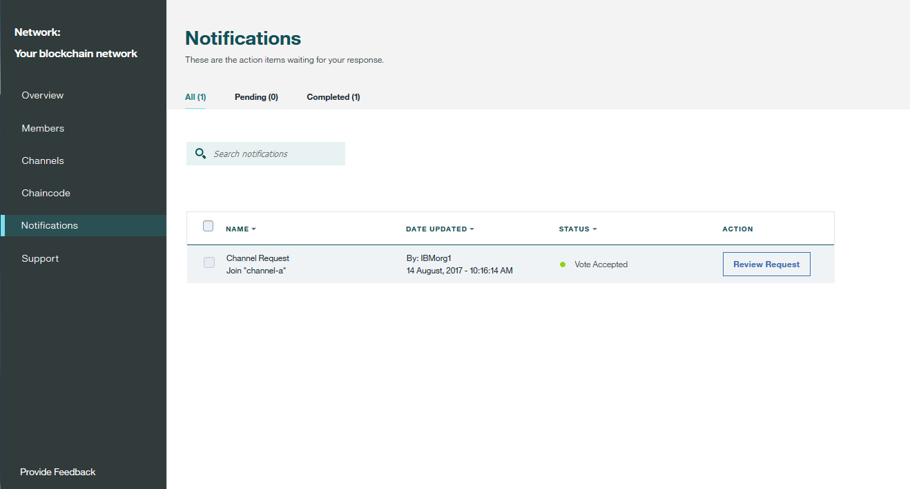

---

copyright:
  years: 2017
lastupdated: "2017-08-15"
---

{:new_window: target="_blank"}
{:shortdesc: .shortdesc}
{:codeblock: .codeblock}
{:screen: .screen}
{:pre: .pre}

# ネットワークの運用
{: #v10_dashboard}

ネットワーク・モニターは、ネットワーク・コンポーネント、メンバー、参加チャネル、パフォーマンス・データ、デプロイ済みのチェーンコードを含む、ブロックチェーン環境の概要を示します。
{:shortdesc}

ネットワーク・モニターには、以下の画面があります。
* 「概要」画面では、ネットワーク・サービスの資格情報やコンポーネントの状況情報を参照し、ピアを追加することができます。
* 「メンバー」画面では、ネットワーク・メンバーや証明書を管理できます。
* 「チャネル」画面では、新規チャネルを作成したり、既存のチャネルの情報を表示したりできます。
* 「チェーンコード」画面では、ピアにチェーンコードをインストールしてインスタンス化することができます。
* 「通知」画面では、保留中の承認を処理したり、完了した承認を表示したりできます。
* 「サポート」画面では、参照資料へのリンクを見つけたり、各リリースの新機能と変更機能を確認したりできます。

## 概要

「概要」画面には、順序付けサービス、CA、ピア・ノードなどのブロックチェーン・コンポーネントについてのリアルタイムの状況情報が表示されます。**「タイプ」**、**「名前」**、**「状況」**、**「アクション」** という 4 つの別々のヘッダーの下に各コンポーネントが表示されます。ブロックチェーン・ネットワークの作成中に、順序付けサービス・ノード 3 つと CA ノード 2 つが自動的に作成されます。 CA ノードはメンバーに固有のノードですが、順序付けサービス・ノードはネットワーク全体で共有される共通のエンドポイントです。

**図 1** に「概要」画面を示します。

*図 1. ネットワークの概要*

- ノード・アクション

  表の**「アクション」**ヘッダーには、コンポーネントを開始または停止するためのボタンがあります。複数のノードを選択し、**「選択済みを開始 (Start Selected)」**ボタンまたは**「選択済みを停止 (Stop Selected)」**ボタンをクリックして、ノードのグループを開始または停止することもできます。**「選択済みを開始 (Start Selected)」**ボタンまたは**「選択済みを停止 (Stop Selected)」**ボタンは、1 つまたは複数のノードを選択すると、表の上部に表示されます。

  **「アクション」**ヘッダーの下のドロップダウン・リストから**「ログの表示 (View Logs)」**をクリックして、コンポーネントのログを確認することもできます。ログから、さまざまなネットワーク・コンポーネント間で行われたリモート・プロシージャー・コールを調べることができるため、デバッグやトラブルシューティングの役に立ちます。例えば、ピアを停止して、そのピアをトランザクションのターゲットにしてみてください。gRPC 接続エラーが表示されるはずです。ピアを再始動してトランザクションを再試行すると、接続が成功します。チャネルがトランザクション処理を続行しているときに、長期間にわたってピアをダウン状態のままにすることもできます。ピアが再び稼働したときに、gossip プロトコルを通じて台帳が同期化されることが分かります。ピアは、完全に台帳を同期化すると、ただちに通常の呼び出しや照会を実行できるようになります。  
- サービス資格情報  
「リソース」タブの右上の**「サービス資格情報」 **ボタンをクリックすると、各コンポーネントの低レベル・ネットワーク情報についての JSONファイルが表示されます。これが、アプリケーションに必要になる構成情報のすべてです。ただし、このファイルには、特定のコンポーネントと共有の順序付けサービス・ノードのアドレスしか含まれていないことに注意してください。追加のピアをターゲットにする必要がある場合は、そのエンドポイントを取得する必要があります。「url」を含むヘッダーに、各コンポーネントの API エンドポイントが表示されます。クライアント・サイド・アプリケーションから特定のネットワーク・コンポーネントをターゲットにするためには、これらのエンドポイントが必要です。また、エンドポイントの定義は一般にはアプリに付随する JSON モデルの構成ファイルに存在します。組織外のピアからの承認を必要とするアプリケーションをカスタマイズする場合は、担当のオペレーターからアウト・オブ・バンド操作でそのピアの IP アドレスを取得する必要があります。クライアントは、応答を返してもらう必要のあるすべてのピアに接続できなければなりません。  
- ピアの追加  
右上の**「ピアの追加」**ボタンをクリックして、ネットワークにピア・ノードを追加できます。メンバーごとに最大 6 つのピアをネットワークに追加できます。ピア・ノードの追加は、最初にネットワークを作成したときやネットワークに参加したときに行うことも、後からネットワーク・モニターで行うこともできます。   
ポップアップの「ピアの追加」パネルで、追加するピア・ノードの数とサイズを選択します。現在は「スモール」のピアしか購入できませんが、最終的には、より大きなワークロードやより高いトランザクション・スループットに対応できるように、「ミディアム」と「ラージ」も提供される予定です。ピアのサイズ変更やパフォーマンス・メトリックの詳細については、近日発表される予定です。
  
## メンバー

「メンバー」画面には、ネットワーク・メンバー情報を表示する「メンバー」タブと、証明書情報を表示する「証明書」タブという 2 つのタブがあります。

**図 2** に、ネットワーク・メンバーが「メンバー」タブに表示されている「メンバー」画面の初期画面を示します。

*図 2. ネットワーク・メンバー*

ネットワークを作成したときに招待したメンバーに加えて、「メンバー」タブから他のメンバーを招待することができます。ネットワークにメンバーを招待するには、機関名とオペレーターの E メール・アドレスを入力して**「メンバーの追加」**をクリックします。ネットワークには、最大で 15 のメンバーが参加できます (ネットワークのイニシエーターを含む)。ネットワークからメンバーを削除するには、メンバーの行の最後にある「削除」記号をクリックします。

**図 3** に、メンバーの証明書が「証明書」タブに表示されている「メンバー」画面の初期画面を示します。

*図 3. 証明書*

オペレーターは、同じ機関に属するメンバーの証明書を「証明書」タブで管理できます。**「証明書の追加」**をクリックして、「証明書の追加」パネルを開きます。証明書に名前を指定し、「鍵」フィールドにクライアント・サイドの PEM 形式の証明書を貼り付け、**「実行依頼 (Submit)」**をクリックします。このクライアント・サイドの証明書を有効にするためにピアを再始動する必要があります。

証明書の鍵の生成方法については、[クライアント・サイドの証明書の生成](v10_application.html#generating-the-client-side-certificates)を参照してください。

## チャネル

ネットワークをチャネルに分割できます。各チャネルは、そのチャネルでインスタンス化されたチェーンコードのデータを表示することを許可されたメンバーのサブセットを表します。トランザクションを実行するためには、すべてのネットワークに 1 つ以上のチャネルが必要です。チャネルごとに固有の台帳があり、その台帳に対して読み取り/書き込み操作を実行するには、ユーザーは正しく認証される必要があります。チャネルに参加していないユーザーは、データを表示できません。

**図 4** に、ネットワークのすべてのチャネルの概要を表示するダッシュボードの初期画面を示します。

*図 4. チャネル*

チャネルを作成すると、チャネル固有の台帳が生成されます。詳しくは、[チャネルの作成](howto/create_channel.html)を参照してください。

また、既存のチャネルを選択して、チャネル、メンバーシップ、アクティブ・チェーンコードに関する詳細を表示することもできます。詳しくは、[ネットワークのモニター](howto/monitor_network.html)を参照してください。  

## チェーンコード

チェーンコードは、資産を作成したり変更したりするためのビジネス・ロジックやトランザクション命令を定義します。

**図 5** に、チェーンコードのダッシュボードの初期画面を示します。

*図 5. チェーンコード*

チェーンコードは、まずピアのファイル・システムにインストールされてから、チャネルでインスタンス化されます。詳しくは、[チェーンコードのインストールとインスタンス化](howto/install_instantiate_chaincode.html)を参照してください。

## 通知

「通知」画面では、保留中の要求を処理したり、完了した要求を表示したりできます。 

**図 6** に「通知」画面を示します。

*図 6. 通知*

* チャネルを作成した場合、または新規チャネルに招待された場合、ネットワーク・モニターに通知が表示されます。 
* 要求は「すべて」、「保留中」、「完了」の各サブタブにグループ分けされています。各サブタブに含まれている要求の数が、サブタブのヘッダーの後ろに表示されています。
   * 「すべて」サブタブには、すべての要求が含まれています。
   * 承認も拒否もしていない要求、まだ参照していない要求は、「未読 (Unread)」サブタブに含まれています。**「要求の確認 (Review Request)」**ボタンをクリックし、チャネル・ポリシーやメンバーなどを表示して要求を確認してから、**承認**または**拒否**します。また、**「後で」**をクリックして、要求を後で処理することもできます。承認した要求が、十分な数のチャネル・オペレーターから承認された場合は、**「要求の実行依頼 (Submit Request)」**をクリックしてチャネルの更新をアクティブにします。   
   * 実行依頼した要求は「完了」サブタブに表示されます。**「要求の確認 (Review Request)」**をクリックして、その詳細を確認できます。
  
要求のリストが長い場合は、上部の検索フィールドで要求を検索できます。保留中の要求は、要求の前のチェック・ボックスを選択し、**「要求の削除 (Delete Requets)」**をクリックして削除できます。完了した要求は削除できません。

## サポート

「サポート」画面には、サポート情報を表示する「サポート」タブと、各リリースの新機能や変更機能が記載された「リリース・ノート」タブという 2 つのタブがあります。

このページのリンクおよびリソースを使用して、トラブルシューティング・フォーラムおよびサポート・フォーラムにアクセスします。問題をデバッグしたり、疑問を解決できない場合は、**「Bluemix サポート・チケットを開く (Open a Bluemix support ticket)」**リンクをクリックし、ガイダンスに従ってチケットを送信してください。

**図 7** に、サポート情報が「サポート」タブに表示されている「サポート」画面の初期画面を示します。

*図 7. ブロックチェーンのサポート*

* [{{site.data.keyword.blockchainfull_notm}} サービスの資料](index.html) (この資料サイト) では、{{site.data.keyword.blockchainfull_notm}} Platform on {{site.data.keyword.Bluemix_notm}} を開始する方法を説明しています。ナビゲーターから対応するトピックを探したり、ページ上部にある検索機能を使用して用語を検索したりできます。  
* [IBM Developer Works ](https://developer.ibm.com/blockchain/) の**コミュニティーのヘルプ**には、開発者向けのリソースや情報があります。  
* **サポート・チケット**の下の [IBM dWAnswers ](https://developer.ibm.com/answers/smartspace/blockchain/) は、質問と回答のやり取りを行うプラットフォームの役割を果たします。過去に投稿された質問から回答を探したり、新しい質問を送信したりできます。質問にはキーワード **blockchain** を含めてください。   
また、[「{{site.data.keyword.Bluemix_notm}} サポート・チケットのオープン」]() オプションを使用して、チケットを {{site.data.keyword.blockchainfull_notm}} サポート・チームに送信することもできます。利用している特定の Bluemix インスタンスの詳細およびコード・スニペットを提供してください。  
* **{{site.data.keyword.blockchain}} サンプル・アプリケーション** の下の[サンプル・アプリケーション ]() には、アプリケーションの開発を支援するガイドやサンプル・コード・スニペットが用意されています。  
* **Hyperledger Fabric** の下にある [Hyperledger Fabric ](http://hyperledger-fabric.readthedocs.io/) と [Hyperledger Fabric コミュニティー ]() では、Hyperledger Fabric スタックの詳細を調べることができます。  
[Hyperledger Expert ](https://chat.hyperledger.org/channel/general) では、Hyperledger Fabric コードについて質問することができます。   
  
  
**図 8** に、各リリースの新機能や変更機能が「リリース・ノート」タブに表示されている「メンバー」画面の初期画面を示します。

*図 8. リリース・ノート*

