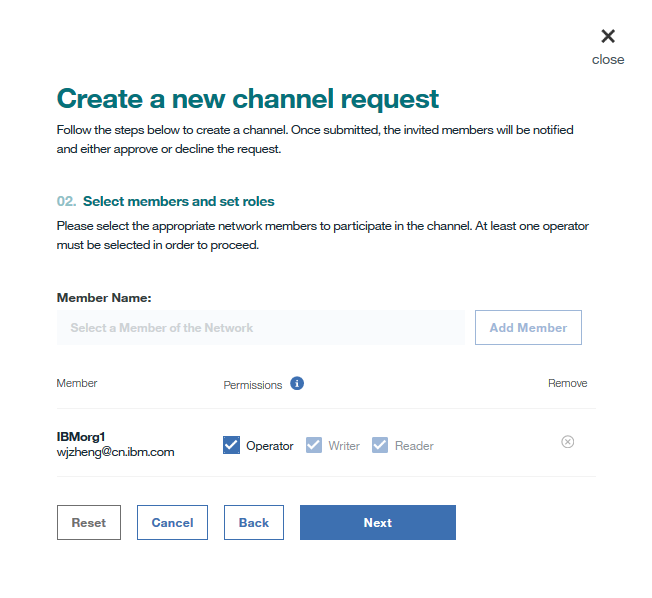

---

copyright:
  years: 2017
lastupdated: "2017-08-14"

---

{:new_window: target="_blank"}
{:shortdesc: .shortdesc}
{:screen: .screen}
{:codeblock: .codeblock}
{:pre: .pre}

# 创建或更新通道

通道是用于分区和隔离数据的一种极其强大的机制，它们为数据隐私提供主要基础。
只有同一通道的成员才能访问此通道的数据。
{:shortdesc}

为确保通道安全性，将配置通道更新策略以定义在创建或更新通道之前，需要就通道创建或更新请求达成一致的通道操作员数。 

## 创建通道
单击“网络监视器”的“通道”屏幕中的**新建通道**按钮，然后完成以下步骤，以提交通道创建请求：  
1. 选择代表通道业务目标的名称，添加描述（如果需要），然后单击**下一步**。通道名称在区块链网络中必须唯一。它必须以字母开头，并且只能包含小写字符、数字或短划线。  
    
    
2. 通过选择网络成员并单击**添加成员**按钮来邀请网络成员的任意组合。通过为每个受邀的成员分配角色来定制许可权，然后单击**下一步**。  
    
  
    * 通道操作员可以查询或更新通道分类帐。通道操作员有权**接受**或**拒绝**通道创建请求，以及提交通道更新请求。每个通道必须至少有一个**操作员**。  
    * 通道作者可以更新通道分类帐。
    * 通道读者仅可以查询通道分类帐。
  
3. 通过选择要核准通道更新请求的通道操作员数来配置通道更新策略，然后单击**提交请求**。
   
    

受邀成员将收到邀请电子邮件。他们还可以在“网络监视器”的**通知**屏幕中找到具有“投票暂挂”状态的请求：
  
* 受邀作为通道操作员的成员可以单击**复查请求**按钮，以复查通道配置，然后**接受**或**拒绝**通道更新请求。如果通道更新请求获得来自通道操作员的足够的**接受**表决，那么其状态将更改为“已接受表决”。
然后，任何通道操作员都可以单击**提交请求**按钮以完成通道更新。  
* 受邀请作为通道作者或读者的成员可以单击**复查请求**按钮以复查通道配置。

作为特殊类型的通道更新请求，当有足够多的通道操作员就通道创建请求达成一致，并且其中某位通道操作员提交该请求时，将创建新的通道。所有通道成员都可以在其“网络监视器”的“通道”屏幕中找到通道。

## 更新通道
如果要修改通道的配置（例如，添加或除去通道成员），或者更改通道更新策略，那么可以提交通道更新请求。在“网络监视器”的“通道”屏幕中，找到要修改的通道，并从**操作**标头下的下拉列表中选择**编辑通道**。完成与提交通道创建请求相同的步骤，以提交通道更新请求。

所有通道成员都将收到有关通道更新请求的电子邮件通知：
* 新邀请的成员会收到邀请他们加入通道的电子邮件通知。他们还可以在“网络监视器”的**通知**屏幕中找到具有“投票暂挂”状态的请求：
  
    * 受邀作为通道操作员的成员可以单击**复查请求**按钮，以复查通道配置，然后**接受**或**拒绝**通道更新请求。如果通道更新请求获得来自通道操作员的足够的**接受**表决，那么其状态将更改为“已接受表决”。
然后，任何通道操作员都可以单击**提交请求**按钮以完成通道更新。  
    * 受邀请作为通道作者或读者的成员可以单击**复查请求**按钮以复查通道配置。
* 除去的成员会收到有关通道更改的电子邮件通知。
* 现有通道操作员还会收到有关通道更新的电子邮件通知。他们还可以在“网络监视器”的**通知**屏幕中找到具有“投票暂挂”状态的请求，以供他们**接受**或**拒绝**：

当有足够多的通道操作员就通道更新请求达成一致，并且其中任何一位通道操作员提交该请求时，将会更新通道。所有通道成员都可以在其“网络监视器”的“通道”屏幕中找到更新的通道。
