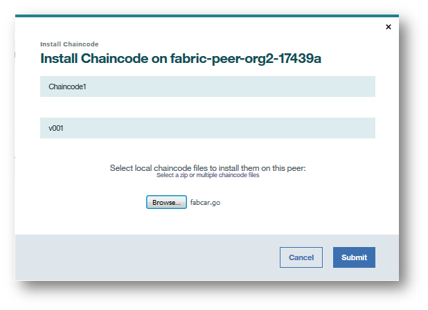

---

copyright:
  years: 2017
lastupdated: "2017-08-14"
---

{:new_window: target="_blank"}
{:shortdesc: .shortdesc}
{:codeblock: .codeblock}
{:screen: .screen}
{:pre: .pre}

# 安装并实例化链代码

链代码是一款以 Go 或 Java 编写的软件，其可封装用于在分类帐中创建和修改资产的业务逻辑和事务处理指示。
链代码在 Docker 容器中运行，该容器与需要与之交互的任何同级相关联。有关开发链代码的更多信息，请参阅[链代码教程 ](http://hyperledger-fabric.readthedocs.io/en/latest/chaincode.html)。
{:shortdesc}

链代码首先安装在同级文件系统上，然后在通道上进行实例化。所有通道成员都需要在将运行此链代码的每个同级上安装链代码。要使用相同的链代码，通道成员必须在链代码安装期间为链代码提供相同的名称和版本。实例化步骤包括初始化键值对和部署链代码容器。
任何同级（应用程序通过该同级与链代码交互）必须将链代码安装在同级的文件系统上，并且具有正在运行的链代码容器。但是，如果同级在多个通道上使用相同的链代码，那么它仅需要链代码容器的单个实例。  

安装和实例化组合是一项强大的功能，因为它允许同级跨多个通道与相同的链代码容器进行交互。唯一的先决条件是要在同级的文件系统上安装实际的链代码源文件。因此，如果一部分常用链代码跨多个通道使用，那么同级仅需要单个链代码容器即可在所有通道分类帐上执行读/写操作。随着网络规模和链代码变得更为复杂，这种轻量型方法证明对计算性能和吞吐量大有益处。  

## 安装链代码
您必须在将运行此链代码的每个同级上安装链代码。要安装链代码，请完成以下步骤：
1. 在“网络监视器”的“链代码”屏幕中，从下拉列表中选择要安装链代码的同级。单击**安装链代码**按钮。  
  
2. 在**安装链代码**弹出面板中，输入链代码的名称和版本。**注意**：将在应用程序中使用名称和版本字符串与已安装的链代码进行交互。单击**浏览**按钮并在本地文件系统中进行导航，以浏览至存储链代码源文件的位置。选择要安装在同级上的一个或多个链代码源文件。此示例显示名称为 `Chaincode1` 且版本为 `v001` 的链代码源文件 `fabrcar.go`，此源文件将安装到 `fabric-peer-org2-17439a` 同级。

## 实例化链代码
在将链代码安装到每个加入通道的同级的文件系统上之后，必须在通道上对链代码进行实例化，以便同级可以通过链代码容器与分类帐交互。实例化对链代码执行任何必要的初始化。通常，这涉及设置组成链代码初始全局状态的键值对。  

您需要在通道上具有**操作员**或**作者**权限才能实例化链代码。在不同同级上具有相同名称和版本的链代码仅需要实例化一次即可部署链代码容器。要实例化链代码，请完成以下步骤：
1. 在“网络监视器”的“链代码”屏幕中，从链代码表中选择要安装链代码的同级并找到要实例化的链代码。然后，单击**操作**标头下的**实例化**按钮。  
    
  
2. 在**实例化链代码**弹出面板中，将键值对设置为链代码初始化的自变量，然后选择要在其上进行实例化的通道。单击**提交**。   
