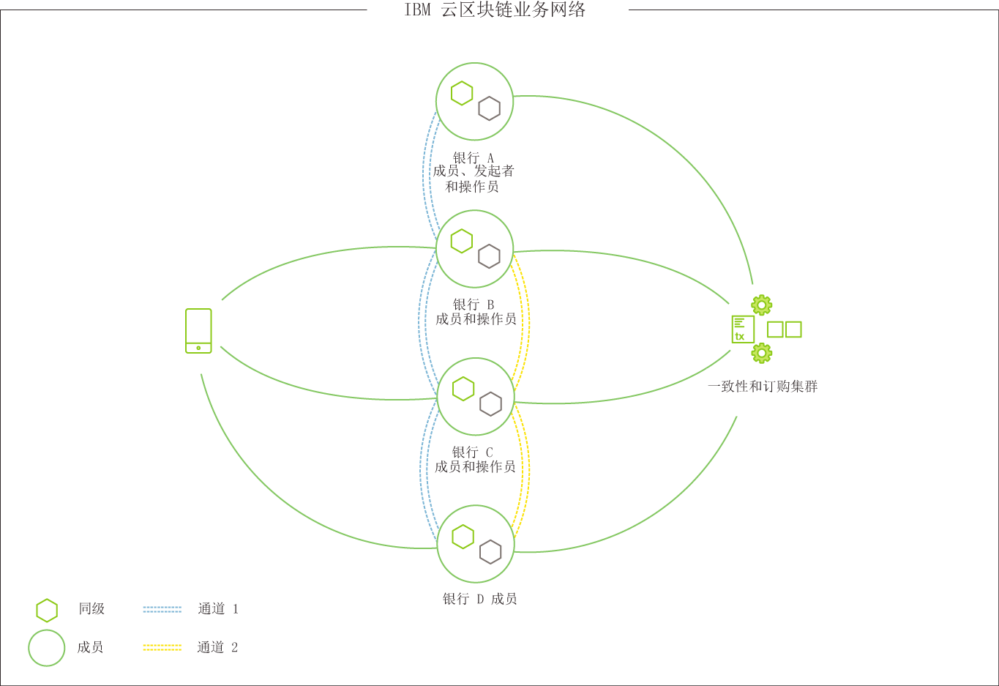

---

copyright:
  years: 2017
lastupdated: "2017-08-24"

---

{:new_window: target="_blank"}
{:shortdesc: .shortdesc}
{:screen: .screen}
{:codeblock: .codeblock}
{:pre: .pre}

# {{site.data.keyword.blockchainfull_notm}} Platform

**注意：**在使用 {{site.data.keyword.blockchainfull}} 产品之前，请阅读[免责声明](needtoknow.html)一节中的技术和支持信息。  
{:shortdesc}

{{site.data.keyword.blockchainfull_notm}} Platform 是唯一能够满足多组织区块链网络的完整生命周期（**开发**、**管理**和**操作**）的集成业务就绪型平台。它旨在通过每个阶段的协作来加速创建“为业务构建”全球区块链网络，该网络具有适用于最严苛用例和受监管行业的性能和安全性。{{site.data.keyword.blockchainfull_notm}} 产品以 Hyperledger Fabric V1.0 代码库为基础构建，利用模块化体系结构来实现企业级别的安全性、数据完整性、可伸缩性和性能，以满足您的业务需求。  

让我们来看看 {{site.data.keyword.blockchainfull_notm}} 网络中的主要活动和角色，了解它们如何适应网络的生命周期。

**注**：下表不代表线性发展。随着应用程序和成员资格的演进，诸如开发和网络管理之类的任务将重复出现。

|  功能     | 活动       | 角色  |
| ------------------------- |--------------------------|-----|
| [开发 ](https://developer.ibm.com/blockchain/sandbox/) | 开发应用程序、开发链代码 | 应用程序开发者 |
| [管理](get_start.html)| 邀请成员、生成凭证、建议管控模型、新建成员加入、传播证书和端点信息 | 网络操作员、网络成员 |
| [操作](v10_dashboard.html)| 监视运行状况和活动、管理新部署、管理成员（添加/除去）、管理链代码生命周期、管理通道、支持 | 网络操作员、网络参与者 |
  
现在，让我们进一步了解这些角色和活动...

## **开发**网络
利用通过 400 多个客户合作项目所提炼出的最佳实践，来探索和加速区块链的发展：
* 确保在拥有显著缩短区块链应用程序开发时间（原先需要六周时间开发的应用程序不到两天就能创建出来）的技术的企业之间保持紧密的一致性。
* 利用 {{site.data.keyword.blockchainfull_notm}} 开发者工具，在现有程序员名册中快速构建区块链技能。
* 为开发人员提供足够的灵活性，可使用开放式和现代工具集，在其首选环境中进行学习和开发。  
  
作为业务所有者，您可以利用 IBM 深厚的行业和区块链专家队伍来帮助发展用例，这些专家在 {{site.data.keyword.blockchainfull_notm}} Garage 中聚集，以利用 IBM Blockchain Platform 的全部功能。 

作为开发者，您可以快速而轻松地使业务需求保持一致，并通过云沙箱和互动演练场，将任何程序员变成区块链开发者，从而加快免费开发区块链应用程序。这些工具旨在将业务规则转变为您首选环境中的代码：
* **在线探索**  
利用 [Hyperledger Composer ](https://hyperledger.github.io/composer/introduction/introduction.html)（一个开放式源代码开发工具），来了解关键区块链概念、创建网络定义以及利用可复用的行业模型和智能合同库。 
* **本地安装**  
利用 Hyperledger Fabric 和 Composer 的 IBM 认证映像（一个用于构建业务网络的开放式源代码框架），直接在笔记本电脑上开发和测试。
* **在云环境中协作**  
用于开发和与他人共享代码的免费选项和收费选项。
  
一个您已开发业务网络，您可以使用此[诀窍 ](https://ibm-blockchain.github.io/platform-deployment/)，将其部署到 IBM Blockchain Platform 上运行的实时网络。

## **管理**网络
有两个选项可用于创建网络的后端环境。首先，您可以使用发布的 Hyperledger Docker 映像，为您提供实施 Composer 库以构建应用程序并与网络交互的选项。或者，您可以在本机编写链代码，并开发服务器端代码以驱动事务处理。在本地运行是对网络配置进行修补、探索潜在用例并开始构建概念证明的绝佳机会。当您的 PoC 开始成形时，您将能够通过在云端管理网络来扩大实施。

通过云部署，您可以获得易于使用的诀窍和脚本集合，来简化在 Kubernetes 上运行的 Hyperledger Fabric 网络的部署。使用此阶段可检查您的 PoC 在托管环境中的行为和稳定性。[{{site.data.keyword.blockchainfull_notm}}容器服务 ](https://ibm-blockchain.github.io/) 最容易让人想到是一种对应用程序功能和弹性的测试机制，以及企业套餐的自然前体。

在您拥有网络后，{{site.data.keyword.blockchainfull_notm}} 旨在创建网络管理体验，为成员提供某种控制，而不是单个成员在完全控制中。{{site.data.keyword.blockchainfull_notm}} Platform 具有第一套集成工具，允许团队通过可定制策略来强制实施变更管理。 

下表显示此管控模型的关键功能：

* 支持集合体管理的民主管理工具。
* 策略编辑器，用于定义灵活的民主策略，以管理对网络的更改。
* 预先构建的工具和策略，支持更快速地上线、定制和激活。
* 具有集成通知、成员活动面板和安全签名集合的多方工作流程工具。

## **操作**网络
利用生产就绪的安全服务来部署和操作分散的网络。开始很小，但通过利用以下功能，随着您成员资格和事务处理量的增加，弹性地对您的网络进行调整：

* 具有许多硬件、固件和软件安全功能的超高安全性环境。
* 强化的体系结构，实现可扩展性、弹性和可用性。
* 针对性能进行优化，并在全球最快的 Linux 计算上运行。
  
在 {{site.data.keyword.blockchainfull_notm}} Platform 上操作网络包括用于简化管理任务的工具和功能：

* 用于在网络上监视和管理资源的仪表板。 
* 完整代码堆栈无缝升级的生命周期管理。
* 集成到门户网站的 24/7 技术支持。
* 强化的安全堆栈，具有无特权访问、恶意软件和篡改抵制、100% 加密，以及许多其他功能，用于具有受监管行业中敏感数据的网络。

## 参与区块链网络 

我们使用术语**参与者**作为最广泛的分类，用于与区块链网络交互的任何组织、个人、应用程序或设备。在“参与者”伞下，有两个不同的分组：**成员**和**用户**。   
 
简单地说，成员拥有有效的数字证书，这允许成员在区块链网络中发出和/或验证事务处理。用户没有证书，但他们仍可以通过某个现有网络成员与区块链网络进行交互。您可以将某个成员的证书视为其“成员资格卡”，就像健身俱乐部一样。当用户可能没有这样的成员资格卡时，他们可以作为现有会员的“访客”进入健身俱乐部。让我们进一步了解这些角色。

### 成员 

{{site.data.keyword.blockchainfull_notm}} Platform 由 Hyperledger Fabric 提供支持，而 Hyperledger Fabric 是一种“许可的区块链”技术。因此，所有成员都通过证书注册到网络中，该证书授予他们将网络用作服务**提供者**（即发出证书、验证/订购事务处理）或**消费者**（即发出事务处理）的许可权。   

- **提供者 - 在成员中，我们信任**：区块链网络由其成员提供支持。要使区块链网络可操作，必须至少有一组成员*提供*基本的区块链服务；包括事务处理验证、事务处理订购和证书管理服务。通过运行这种服务，这些成员会成为区块链网络中心共享分类帐完整性的维护者。因此您会问：您需要多少成员才能使区块链正常运行？答案取决于网络的信任需求。某些网络容许一个更为集中的信任模型，这需要较少的成员充当提供者。其他网络需要更多不同成员集（即法律上独立的实体），并维护更分散的信任模型。典型的更为集中的信任模型是供应链可视性网络，其提供成员是全球零售商、全球航运公司和 IBM。在此情况下，这三个成员将充当网络的“信任的基础”，从而提供区块链网络的基本服务。这些成员可以发放证书给进口商、出口商、报关代理和零售商，以便他们可以加入（发出交易）到网络中。此网络通过让更多成员参与提供基础服务来分散信任，从而确保所有成员都具有控制权，没有单个成员具有专用控制权。一个典型的网络将具有大约 10 个提供基础区块链服务的成员。

- **消费者 - 建立了信任，现在可以调用功能**：建立信任的基础后，网络就可以发展了。很常见的是，网络中的大部分成员只是使用网络来针对分布式分类帐调用事务处理。这些成员只是*消费者*，不参与向网络提供基本服务。典型网络将具有 10 到 100 个有权在给定区块链网络中发出交易的成员。

#### 成员角色
 
有时，将成员理解为可体现成员在业务网络中的作用的角色会很有用。以下是我们经常看到的一些应用。
 
- **发起者**：已由其他成员选择以启动区块链网络的成员。IBM Blockchain Platform 需要单个成员登录到 IBM Blockchain Platform 并执行任务以启动网络。这些操作包括命名网络、邀请初始成员集，以及设置缺省网络操作策略集。这是瞬态角色。启动网络后，发起者不保留特权，只需恢复成员角色即可。  

- **维护者**：运行一个或多个网络同级和 CA 的成员。这些成员通过参与共识过程来维护分布式分类帐的完整性，这是在区块链网络上验证事务处理的方式。维护者通过 CA 的所有权，还能够向参与者发出证书并授予他们对网络的访问权。 
 
- **操作员**：代表其他网络成员运行服务（包括事务处理订购服务、认证中心、事务处理网关和其他基本网络服务）的成员。缺省情况下，IBM 是在 IBM Blockchain Platform 上部署的网络的网络操作员。
 
- **审计员**：该成员已由网络授予许可权，可在网络上执行审计功能。审计功能的示例包括记帐、合规性跟踪或分析。审计员角色通常意味着该成员有权查看更多分类帐交易和/或加入更多交易渠道。

### 用户

虽然区块链网络中可能有数以百计的成员，但可能有数以千计的用户。用户是区块链网络中通过与现有成员的“信任关系”而对分类帐具有直接访问权的参与者。例如，某些移动应用程序使用其自己的用户认证和授权方案（OAuth、OpenID），并将这些凭证映射到区块链网络中的一个或多个凭证成员，这很常见。通常情况下，会创建代理或网关服务来执行此映射功能，从而将外部世界映射到区块链世界。

## 基础网络服务 

要使区块链可操作，成员可以通过运行一个或多个基础网络服务，建立信任的基础： 

- **订购服务**：订购和同步化事务处理  
本质上，订购服务是网络的定义。它包含每个成员的身份信息、有关通道的信息和一组策略，指示允许哪些成员执行特定任务（例如，邀请其他成员、创建通道等）。每个事务处理和配置操作都将流经订购服务，因此它是事物总体方案中的一个非常关键的部分。鉴于订购服务非常重要，因此很容易看到独裁编排的缺陷，可能只有一个成员拉出了这些字符串。为了应对此问题，订购服务由网络成员共同管理，而管控实施联合管理。换句话说，是集体而不是单方面作出决定。所有成员在网络中拥有股权，并且通过扩展，在任何配置和定制其在网络中的立场的任何操作中都有投票权。这些“民主”概念和共同作出的决定是一个受信任和分散网络的固有构建块。IBM 充当 IBM Blockchain Platform 上部署的任何网络的订购服务的“操作员”。
 
- **认证中心**：向参与者发出证书  
简单地说，“认证中心”(CA) 提供成员资格。网络中的所有实体（同级、订货人、客户等）必须具有通信、认证和最终进行事务处理的身份。这些“身份”以 x509 证书（即注册证书）形式存在，要想直接参与区块链网络必须要有这些证书。还有间接参与的方法，但稍后我们会进行讨论。CA 最容易让人想到是一个“橡皮图章”，为身份提供认证和可信性。每个成员都拥有自己的 CA，通过此 CA，他们不仅可以为自己完全拥有的组件（同级）签署证书，还可以签署第三方客户机和应用程序。您可以将成员的 CA 看做特殊的笔或公证人印章。由此 CA 签署的证书是访问网络的先决条件。
 
- **同级**：验证/支持事务处理  
同级存在的目的是执行两个主要功能：执行/验证事务处理和维护分类帐。同级运行智能合同，并且是网络通道上的事务处理历史记录和资产当前状态的持有者。在当天结束时，这都是有关访问同级（直接或间接）以及针对分类帐执行读写操作的所有信息。当某个成员提供对网络的最终用户访问权时，他们确实提供对同级功能的访问权。

当某个成员通过 {{site.data.keyword.blockchainfull_notm}} Platform 加入网络时，标准发行是同级和 CA。对于生产网络，成员将希望运行这些服务的多个实例，以确保可用性。缺省情况下，IBM 会针对由 {{site.data.keyword.blockchainfull_notm}} Platform 创建的网络运行“订购服务”。  

## {{site.data.keyword.blockchainfull_notm}} Platform

{{site.data.keyword.blockchainfull_notm}} Platform 提供高度安全和许可的区块链网络，通过此网络，已认证的成员可轻松定义资产并创建用于修改和交换资产的业务解决方案。启动生产级区块链网络不再是一个繁琐而复杂的过程。借助 {{site.data.keyword.blockchainfull_notm}} Platform，您可以利用一个编排框架，允许您**以创记录的时间将联盟组织到活动区块链网络**。我们提供了联盟友好的工具，旨在简化多个机构的彼此连接，并创建一个由民主管理的网络。通过内置的仪表板监视器和供应的实用程序，网络的创建、管控和管理任务变得直观且透明。通过前文所述创建网络和实施管控不再是繁琐的流程，联盟还可以转而**专注于部署智能合同和转移资产和信息**。      
{:shortdesc}

网络不可或缺组件（同级、订购服务、认证中心、链代码）的**高可用性**消除了单一故障点可能引起的严重影响。内置仪表板监视器可轻松地管理这些组件，同时提供强大的机制对资产和智能合同进行可视化。

Hyperledger Fabric V1.0 体系结构的**模块性**和网络角色的显著分离提供了一个基础架构，用于为各种用例实现可伸缩性和适应能力。 

事务处理生命周期中产生的支票和余额可确保一致而全面的审查结果；通过实施众所周知的 Gossip 协议，分类帐时刻保持同步。通过在整个网络不断地施行**签名/验证**操作，轻松地实施身份和访问控制。  

提供**管控工具**，允许成员为其网络管理重要业务规则。例如，您可能想要实施策略以定义必须有多少网络成员同意才能允许新成员加入。或者，可能有一项资产需要每个参与者保证，才能进行修改。对于任何类型的业务网络来说，管控规则是必要的基础组成部分，通常它们会非常复杂。管控工具（如策略编辑器）可极大地简化此过程。

服务在**高度安全和隔离**的环境中运行，对网络组件没有外部访问权（包括根访问权）。数据在运行时和暂停时加密，硬件安全模块允许按照行业规定保护数字密钥。硬件虚拟化用于在隔离环境中运行每个节点，从而保护网络中的其他节点远离可能具有错误或恶意链代码的同级。通过实施高级加密，加快了散列、签名/验证操作和组件对组件通信。

继续之前，让我们看一下 {{site.data.keyword.blockchainfull_notm}} Platform 中的简单配置。**图 1** 描述了由四个成员（每个都拥有两个同级）、一个负责分发密码身份资料的认证中心，以及一个定义策略和网络参与者的订购服务组成的已部署区块链网络的示例。蓝色通道包含全部四个网络成员，而黄色通道仅限于三个成员：银行 B、C 和 D。我们也看到银行 A 扮演了网络发起者的角色，银行 D 仅作为成员在黄色通道的上下文中存在。最后，拥有正确签名的 x509 证书的最终用户或应用程序能够向网络中的同级发送调用。如前所述，可以想象最终用户甚至都不知道区块链网络的存在。

*图 2. 由四个成员组成，利用通道隔离数据的区块链网络示例*

## {{site.data.keyword.IBM_notm}} 成员资格产品

下表汇总了当前和未来的成员资格选项。[企业套餐](enterprise_plan.html)是当前可用的成员资格选项。

|       | 条目      | [企业](enterprise_plan.html)  | Enterprise Plus | 自我管理
| ------------------------- |--------------------------|-----|-----|------|
| **包含的内容**| 基本服务级别| **高级服务级别、企业生产就绪**| 性能和隔离的专用计算| 要在自己的基础架构上安装的软件堆栈 + 连接到此云服务上托管的网络|
| **计费策略**| 每小时收费| **每月预订**| 每月预订| 每月预订|
| **可用性**| 即将推出| **可立即获取**| 即将推出| 计划于 2018 年|

立即注册以获取 [{{site.data.keyword.blockchainfull_notm}} 成员资格 ](https://console.bluemix.net/catalog/services/blockchain?env_id=ibm:yp:us-south&taxonomyNavigation=apps)！

## {{site.data.keyword.IBM_notm}} 支持 

{{site.data.keyword.IBM_notm}} 提供 {{site.data.keyword.IBM_notm}} 实施的 {{site.data.keyword.blockchain}} 解决方案的支持。有关 {{site.data.keyword.blockchainfull_notm}} 支持的更多信息，请参阅[获取支持](ibmblockchain_support.html)。

有关所有 Hyperledger Fabric V1.0 特性和功能的完整详细信息，请参阅 [Hyperledger Fabric 文档 ](http://hyperledger-fabric.readthedocs.io/en/latest/)。
