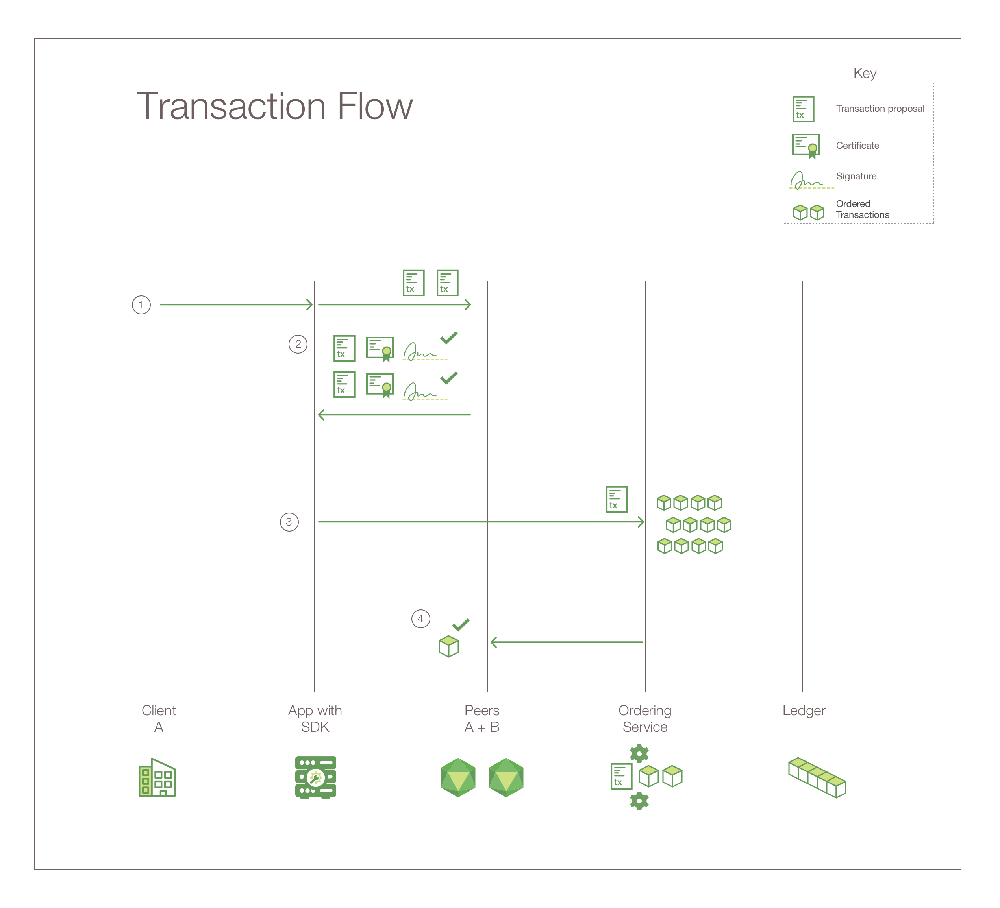

---

copyright:
  years: 2017
lastupdated: "2017-07-17"

---

{:new_window: target="_blank"}
{:shortdesc: .shortdesc}
{:codeblock: .codeblock}
{:screen: .screen}
{:pre: .pre}

# Transaction flow

To ensure data consistency and integrity, Hyperledger Fabric v1.0 implements multiple checkpoints throughout the transaction flow, including invocation, endorsement, ordering, and comitment to the ledger.
{:shortdesc}

**Figure 1** depicts the transaction flow on a Hyperledger Fabric v1.0 blockchain network:

*Figure 1. Transaction flow on a Hyperledger Fabric v1.0 network*

On a Hyperledger Fabric v1.0 network, the flow of data for queries and transactions is intitiated by a client-side application submitting a transaction request to peers on a channel. The initial flow of data across the network is common to both queries and transactions:

1. Using the `channel.SendTransactionProposal` API available in the SDK, a client application signs and submits a transaction proposal to the appropriate endorsing peers on the specified channel.  This initial transaction proposal is a **request** for endorsement.  
2. Each peer on the channel verifies the identity and authority of the submitting client, and (if valid) runs the specified chaincode against the supplied inputs (key/vals).  Based on the transaction results and the Endorsement Policy for the invoked chaincode, each peer returns a signed YES or NO response to the application.  Each signed YES response is an **endorsement** of the transaction.  
	
	At this point in the transaction flow, the process diverges for queries and transactions.  If the proposal called a query function in the chaincode, the application returns the data to the client.  If the proposal called a function in the chaincode to update the ledger, the application continues with the following steps:  
3. The application forwards transaction (read/write set & endorsements) to the network **ordering service**.  
4. The transaction(s) is then proxied to the channel's partition topic in the Kafka cluster for ordering.  All channel peers validate each transaction in the block by applying the chaincode-specific Validation Policy and running a Concurrency Control Version Check.  
	* Any transactions that fail the validation process are marked as invalid in the block, and the block is appended to the channel's hashchain.  
	* All valid transactions update the state database accordingly with the modified key/val pairs.  
	
The **gossip data dissemination protocol** continually broadcasts ledger data across the channel to ensure synchronized ledgers amongst peers.
